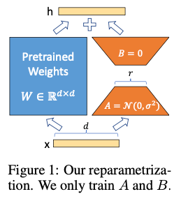

# LORA 논문 번역

### LORA: 대규모 언어 모델의 저랭크 적응

**저자**: Edward Hu, Yelong Shen, Phillip Wallis, Zeyuan Allen-Zhu, Yuanzhi Li, Shean Wang, Lu Wang, Weizhu Chen

**소속**: Microsoft Corporation

{edwardhu, yeshe, phwallis, zeyuana, yuanzhil, swang, luw, wzchen}@microsoft.com

[yuanzhil@andrew.cmu.edu](mailto:yuanzhil@andrew.cmu.edu)

(버전 2)

---

### 초록

자연어 처리(NLP)의 중요한 패러다임은 대규모 일반 도메인 데이터에 대한 사전 학습과 특정 작업이나 도메인에 대한 적응으로 구성됩니다. 모델이 더 커짐에 따라 모든 모델 파라미터를 다시 학습하는 전체 파인튜닝은 점점 더 어려워집니다. 예를 들어, GPT-3 175B의 경우, 파인튜닝된 모델 각각이 1750억 개의 파라미터를 가지며, 이러한 독립적인 모델 배포는 매우 비쌉니다. 우리는 '저랭크 적응(Low-Rank Adaptation, LoRA)'을 제안하며, 이는 사전 학습된 모델의 가중치를 고정하고, 변환기(Transformer) 아키텍처의 각 층에 훈련 가능한 랭크 분해 행렬을 주입하여, 다운스트림 작업을 위한 훈련 가능한 파라미터 수를 크게 줄입니다. LoRA는 GPT-3 175B를 Adam 옵티마이저로 파인튜닝한 것과 비교하여, 훈련 가능한 파라미터 수를 10,000배 감소시키고 GPU 메모리 요구량을 3배 줄일 수 있습니다. LoRA는 훈련 가능한 파라미터 수가 더 적음에도 불구하고, RoBERTa, DeBERTa, GPT-2, GPT-3에서 파인튜닝과 비슷하거나 더 나은 성능을 보여주며, 높은 훈련 처리량을 가지고 있습니다. 또한 어댑터와 달리 추가적인 추론 지연이 없습니다. 우리는 언어 모델 적응에서의 저랭크 결핍에 대한 실증적인 연구를 제공하며, LoRA의 효율성을 설명합니다. 또한 LoRA를 PyTorch 모델과 쉽게 통합할 수 있는 패키지를 제공하며, RoBERTa, DeBERTa, GPT-2에 대한 구현과 모델 체크포인트를 [https://github.com/microsoft/LoRA에서](https://github.com/microsoft/LoRA%EC%97%90%EC%84%9C) 제공합니다.

---

### 1. 서론

자연어 처리(NLP)의 많은 애플리케이션은 하나의 대규모 사전 학습 언어 모델을 다양한 다운스트림 애플리케이션에 적응시키는 것에 의존합니다. 이러한 적응은 일반적으로 모든 사전 학습된 모델 파라미터를 업데이트하는 파인튜닝을 통해 이루어집니다. 하지만 파인튜닝의 주요 단점은 새로운 모델이 원래 모델만큼 많은 파라미터를 포함한다는 점입니다. 시간이 지남에 따라 더 큰 모델이 몇 달마다 훈련되면서, 이는 GPT-2(Radford et al., b)나 RoBERTa large(Liu et al., 2019)에서는 단순한 불편함이었지만, GPT-3(Brown et al., 2020)의 경우 1750억 개의 훈련 가능한 파라미터를 가지고 있어 배포에서 심각한 문제로 변화했습니다.

많은 연구자들이 이 문제를 해결하기 위해 일부 파라미터만 적응시키거나 새로운 작업을 위한 외부 모듈을 학습하는 방법을 시도했습니다. 이를 통해 각 작업에 대해 사전 학습된 모델 외에 소수의 작업별 파라미터만 저장하고 로드할 수 있어, 배포 시 운영 효율성을 크게 향상시킬 수 있습니다. 그러나 기존 기술은 여전히 여러 문제를 안고 있습니다.

---

### 그림 1: 재매개화 방법

- 그림 1에서는 LoRA의 재매개화 방법을 보여줍니다. 우리는 A와 B 행렬만 훈련하며, 사전 학습된 가중치(W)는 그대로 유지됩니다.

---

### 각주

* 동일 기여

0 버전 1과 비교하여, 본 초안에는 더 나은 기준선, GLUE 실험, 어댑터 지연 시간 관련 내용이 추가되었습니다.

1 GPT-3 175B는 몇 샷 학습으로 비트리비얼한 성능을 보이지만, 파인튜닝을 통해 성능이 크게 향상됩니다.

---

다양한 방법이 모델의 깊이를 확장하거나 모델의 사용 가능한 시퀀스 길이를 줄여 추론 지연을 초래합니다 (Houlsby et al., 2019; Rebuffi et al., 2017; Li & Liang, 2021; Lester et al., 2021; Hambardzumyan et al., 2020; Liu et al., 2021). 이러한 방법은 종종 미세 조정(fine-tuning) 기준 성능을 충족하지 못하며, 효율성과 모델 품질 간의 트레이드오프를 제공합니다.

Li et al. (2018a)와 Aghajanyan et al. (2020)의 연구에서 영감을 받아, 과적합된 모델이 실제로 저차원의 내재적 공간에 존재함을 보였습니다. 우리는 모델 적응 중에 가중치 변화도 저차원의 "내재적 랭크"를 가지고 있다고 가정하며, 이를 기반으로 LoRA(Low-Rank Adaptation) 접근 방식을 제안합니다. LoRA는 사전 학습된 가중치를 고정한 채, 적응 중 밀집 레이어의 변화에 대한 랭크 분해 행렬을 최적화함으로써 신경망의 일부 밀집 레이어를 간접적으로 훈련할 수 있게 합니다

GPT-3 175B를 예로 들어, 전체 랭크가 12,288인 경우에도 랭크가 1 또는 2인 매우 낮은 랭크가 충분함을 보여줍니다. 이는 LoRA가 저장 및 계산 효율성을 모두 갖추고 있음을 의미합니다.

### LoRA의 주요 장점:

1. **공유된 사전 학습 모델**: 다양한 작업을 위한 작은 LoRA 모듈을 구축할 수 있으며, 공유된 모델을 고정하고 작업 전환 시 행렬 A와 B를 교체하여 저장 요구 사항 및 작업 전환 오버헤드를 크게 줄일 수 있습니다.
2. **효율적인 훈련**: 대부분의 파라미터에 대해 그라디언트를 계산하거나 옵티마이저 상태를 유지할 필요가 없어 하드웨어 요구 사항이 최대 3배 낮아집니다.
3. **추론 지연 없음**: 간단한 선형 설계를 통해 배포 시 훈련 가능한 행렬을 고정된 가중치와 병합하여, 완전한 미세 조정 모델과 비교해도 추론 지연이 발생하지 않습니다.
4. **다양한 방법과 결합 가능**: LoRA는 프리픽스 튜닝과 같은 기존의 많은 방법과 결합할 수 있습니다.

### 용어와 관례:

Transformer 구조를 자주 참조하며, 그 차원의 일반적인 용어를 사용합니다. Transformer 레이어의 입력 및 출력 차원 크기를 $d_{\text{model}}$이라고 부릅니다. 우리는 자기 주의 모듈의 질의/키/값/출력 투영 행렬을 각각 $W_q, W_k, W_v, W_o$로 지칭합니다. $W$ 또는 $W_0$는 사전 학습된 가중치 행렬을, $\Delta W$는 적응 중에 누적된 그라디언트 업데이트를 나타냅니다. LoRA 모듈의 랭크는 $r$로 표시됩니다.

### 2. 문제 정의

우리의 제안은 훈련 목표와 무관하지만, 언어 모델링을 주요 사례로 다룹니다. 다음은 언어 모델링 문제와 특히 특정 작업에 대한 프롬프트가 주어졌을 때 조건부 확률을 최대화하는 방법에 대한 간략한 설명입니다.

사전 학습된 자기회귀 언어 모델 $P_{\Phi}(y|x)$가 주어졌다고 가정해 봅시다. 예를 들어, $P_{\Phi}(y|x)$는 Transformer 구조를 기반으로 한 GPT와 같은 다중 작업 학습자일 수 있습니다. 이 사전 학습된 모델을 요약, 기계 독해(MRC), 자연어를 SQL로 변환(NL2SQL)하는 등의 다운스트림 조건부 텍스트 생성 작업에 적응시키는 것을 고려해 보십시오. 각 다운스트림 작업은 문맥-타겟 쌍의 학습 데이터셋 $Z = \{(x_i, y_i)\}_{i=1, \dots, N}$으로 표현됩니다.

예를 들어, NL2SQL에서는 $x_i$가 자연어 질의이고 $y_i$가 해당하는 SQL 명령어입니다. 요약 작업에서는 $x_i$가 기사 내용이고 $y_i$가 그 요약입니다

전체 파인튜닝에서, 모델은 사전 학습된 가중치 Φ0로 초기화되고, 조건부 언어 모델링 목표를 최대화하기 위해 그래디언트를 따라 반복적으로 업데이트되어 Φ0 + ∆Φ로 변환됩니다:

$\max_{\Phi} \sum_{(x,y) \in Z} \sum_{t=1}^{|y|} \log P_{\Phi}(y_t | x, y_{<t})$

전체 파인튜닝의 주요 단점 중 하나는 각 다운스트림 작업마다 ∆Φ라는 별도의 파라미터 세트를 학습하게 되며, 이 파라미터의 차원 |∆Φ|는 |Φ0|와 같습니다. 따라서 사전 학습된 모델이 매우 큰 경우(GPT-3와 같이 |Φ0| ≈ 1750억), 많은 독립적인 파인튜닝된 모델을 저장하고 배포하는 것은 매우 어렵습니다.

이 논문에서는 작업별 파라미터 증가량 ∆Φ = ∆Φ(Θ)를 훨씬 작은 크기의 파라미터 세트 Θ로 인코딩하는, 더 파라미터 효율적인 접근 방식을 채택합니다. 여기서 |Θ| ≪ |Φ0|입니다. ∆Φ를 찾는 작업은 Θ를 최적화하는 문제로 전환됩니다:

$max_{\Theta} \sum_{(x,y) \in Z} \sum_{t=1}^{|y|} \log P_{\Phi_0 + \Delta \Phi(\Theta)}(y_t | x, y_{<t})$

다음 섹션에서는 ∆Φ를 계산 및 메모리 효율적으로 인코딩하기 위해 저랭크 표현을 사용하는 방법을 제안합니다. GPT-3 175B의 경우, 훈련 가능한 파라미터 수 |Θ|는 |Φ0|의 0.01% 정도로 줄일 수 있습니다.

---

### 3. 기존 솔루션은 충분하지 않은가?

우리가 해결하려는 문제는 새로운 것이 아닙니다. 전이 학습이 시작된 이후, 모델 적응을 더 파라미터 효율적이고 계산 효율적으로 만들기 위한 수많은 연구가 진행되었습니다. 잘 알려진 연구들에 대한 조사는 6장에서 다룹니다. 언어 모델링을 예로 들어, 효율적인 적응에 대한 두 가지 대표적인 전략은 어댑터 레이어를 추가하는 것(Houlsby et al., 2019; Rebuffi et al., 2017; Pfeiffer et al., 2021; Rücklé et al., 2020)과 입력 레이어 활성화 일부를 최적화하는 것(Li & Liang, 2021; Lester et al., 2021; Hambardzumyan et al., 2020; Liu et al., 2021)입니다. 그러나 이 두 전략 모두 대규모 및 지연에 민감한 프로덕션 환경에서는 한계가 있습니다.

---

### 어댑터 레이어는 추론 지연을 유발함

어댑터의 변형은 다양합니다. 우리는 트랜스포머 블록마다 두 개의 어댑터 레이어가 있는 Houlsby et al. (2019)의 원래 설계와, 각 블록에 하나의 어댑터 레이어와 추가적인 LayerNorm(Ba et al., 2016)이 있는 Lin et al. (2020)의 최근 설계를 중점적으로 다룹니다. 계층을 제거하거나 다중 작업 설정을 활용하여 전반적인 지연을 줄일 수 있지만, 어댑터 레이어의 추가 계산을 피할 직접적인 방법은 없습니다. 어댑터 레이어는 매우 작은 병목 차원을 가지고 있어(FLOP 수가 적기 때문에) 파라미터 수는 원래 모델의 1% 미만인 경우도 있습니다. 그러나 대형 신경망은 하드웨어 병렬 처리에 의존하여 지연 시간을 낮게 유지하는데, 어댑터 레이어는 순차적으로 처리해야 합니다. 이는 일반적으로 배치 크기가 1인 온라인 추론 환경에서 차이를 만듭니다. GPT-2 (Radford et al., b) medium을 단일 GPU에서 실행할 때도, 어댑터를 사용할 경우 병목 차원이 매우 작아도 지연 시간이 눈에 띄게 증가하는 것을 확인할 수 있습니다(표 1 참조).

이 문제는 Shoeybi et al. (2020) 및 Lepikhin et al. (2020)에서와 같이 모델을 샤딩해야 할 때 더 심각해집니다. 추가적인 깊이는 AllReduce나 Broadcast와 같은 동기화 GPU 작업을 더 많이 필요로 하기 때문입니다. 어댑터 파라미터를 여러 번 중복 저장하지 않는 한 이 문제는 더 악화됩니다.

---

### 프롬프트를 직접 최적화하는 것은 어렵다

프리픽스 튜닝(Li & Liang, 2021)과 같이 프롬프트를 직접 최적화하는 방법은 다른 도전에 직면합니다. 우리는 프리픽스 튜닝이 최적화하기 어렵고, 훈련 가능한 파라미터가 증가함에 따라 성능이 일관되지 않게 변하는 것을 관찰했으며, 이는 원본 논문에서의 유사한 관찰과 일치합니다. 더 근본적으로는, 시퀀스 길이의 일부를 적응에 예약하는 것은 다운스트림 작업을 처리할 수 있는 시퀀스 길이를 줄이게 되어, 다른 방법에 비해 프롬프트 튜닝의 성능을 떨어뜨리는 것으로 보입니다. 작업 성능에 대한 연구는 5장에서 다룹니다.

---

---

**표 1**: GPT-2 medium 모델에서 단일 순방향 패스의 추론 지연 시간(밀리초 단위)을 100번의 시도에서 평균 측정한 결과입니다. NVIDIA Quadro RTX8000을 사용했습니다. “|Θ|”는 어댑터 레이어에서 훈련 가능한 파라미터 수를 나타냅니다. AdapterL과 AdapterH는 섹션 5.1에서 설명하는 어댑터 튜닝의 두 가지 변형입니다. 온라인 단일 시퀀스 길이 환경에서 어댑터 레이어로 인한 추론 지연은 상당할 수 있습니다. 전체 연구는 부록 B를 참조하십시오.

---

### 4. 우리의 방법

우리는 LoRA의 간단한 설계와 실질적인 이점을 설명합니다. 여기서 설명한 원칙들은 딥러닝 모델의 모든 밀집층에 적용할 수 있지만, 실험에서는 트랜스포머 언어 모델의 특정 가중치에 중점을 둡니다.

---

### 4.1 저랭크로 매개변수화된 업데이트 행렬

신경망에는 매트릭스 곱셈을 수행하는 많은 밀집층이 포함되어 있습니다. 이러한 층의 가중치 행렬은 일반적으로 풀랭크를 가집니다. Aghajanyan et al. (2020)은 사전 학습된 언어 모델이 적은 "내재적 차원"을 가지고 있어, 더 작은 부분공간으로 무작위 투영되더라도 여전히 효율적으로 학습할 수 있음을 보여주었습니다. 우리는 이로부터 영감을 받아, 적응 중에 가중치 업데이트가 저 "내재적 랭크"를 가진다고 가정합니다. 사전 학습된 가중치 행렬 W0 ∈ ℝd×k에 대해, W0 + ∆W = W0 + BA로 저랭크 분해로 업데이트를 제한하며, 여기서 B ∈ ℝd×r, A ∈ ℝr×k이고 랭크 r ≪ min(d, k)입니다. 훈련 중에는 W0는 고정되어 그래디언트 업데이트를 받지 않으며, A와 B만 훈련 가능한 파라미터를 포함합니다. W0와 ∆W = BA는 동일한 입력과 곱해지고, 각각의 출력 벡터는 좌표별로 합산됩니다. h = W0x일 때, 우리의 수정된 순방향 패스는 다음과 같습니다:

$h = W_0x + \Delta Wx = W_0x + BAx$

우리는 그림 1에서 우리의 재매개변수를 설명합니다. A는 랜덤 가우시안 초기화를 사용하고, B는 0으로 설정하여, 훈련 시작 시 ∆W = BA가 0이 되게 합니다. 그런 다음 우리는 ∆Wx에 대해 αr로 스케일링하며, 여기서 α는 r에서의 상수입니다. Adam으로 최적화할 때, α를 조정하는 것은 학습률을 조정하는 것과 거의 동일하며, 초기화를 적절히 스케일링하면 α를 처음 시도하는 r로 단순히 설정하고 조정하지 않습니다. 이 스케일링은 r을 변경할 때 과도한 하이퍼파라미터 조정을 줄이는 데 도움이 됩니다(Yang & Hu, 2021).

---

### 전체 파인튜닝의 일반화

전체 파인튜닝의 더 일반적인 형태는 사전 학습된 파라미터의 일부를 훈련할 수 있게 합니다. LoRA는 한 단계 더 나아가 적응 중에 가중치 행렬에 대한 누적 그래디언트 업데이트가 풀랭크일 필요가 없도록 합니다. 이는 모든 가중치 행렬에 LoRA를 적용하고 모든 바이어스를 훈련할 때, LoRA 랭크 r을 사전 학습된 가중치 행렬의 랭크로 설정하면, 우리는 대략 전체 파인튜닝의 표현력을 회복할 수 있음을 의미합니다. 즉, 훈련 가능한 파라미터 수를 증가시킬수록, LoRA 훈련은 원래 모델을 훈련하는 것과 대략 수렴하며, 어댑터 기반 방법은 MLP로, 프리픽스 기반 방법은 긴 입력 시퀀스를 처리할 수 없는 모델로 수렴합니다.

---

### 추가적인 추론 지연 없음

프로덕션에서 배포할 때, 우리는 W = W0 + BA를 명시적으로 계산하고 일반적인 방식으로 추론을 수행할 수 있습니다. W0와 BA는 모두 ℝd×k에 있습니다. 다른 다운스트림 작업으로 전환해야 할 때, 우리는 BA를 빼고 다른 B'A'를 더하여 W0를 복구할 수 있으며, 이는 메모리 오버헤드가 매우 적은 빠른 작업입니다. 추론 시 추가적인 지연을 발생시키지 않도록 보장됩니다.

---

### 4.2 트랜스포머에 LORA 적용하기

원칙적으로, 우리는 신경망의 가중치 행렬 중 일부에 LoRA를 적용하여 훈련 가능한 파라미터 수를 줄일 수 있습니다. 트랜스포머 아키텍처에는 자기-주의 모듈에서 네 개의 가중치 행렬($W_q, W_k, W_v, W_o$)과 MLP 모듈에서 두 개의 가중치 행렬이 있습니다. 우리는 $W_q$ (또는 $W_k, W_v$)를 단일 행렬로 취급합니다. 이 행렬은 차원이 $d_{\text{model}} \times d_{\text{model}}$이지만, 출력 차원은 일반적으로 주의 헤드로 나뉩니다. 우리의 연구는 단순함과 파라미터 효율성을 위해 다운스트림 작업에서 주의 가중치만 적응시키고 MLP 모듈은 동결하여 훈련하지 않습니다. 트랜스포머에서 다양한 유형의 주의 가중치 행렬 적응에 대한 연구는 섹션 7.1에서 다룹니다. MLP 레이어, LayerNorm 레이어 및 바이어스 적응에 대한 실증적인 연구는 추후 작업으로 남겨둡니다.

---

### 실질적인 이점과 한계

가장 큰 이점은 메모리 및 저장소 사용량의 감소입니다. Adam으로 훈련된 대형 트랜스포머의 경우, 우리는 동결된 파라미터에 대한 옵티마이저 상태를 저장할 필요가 없기 때문에 $r \ll d_{\text{model}}$일 때 VRAM 사용량을 최대 2/3까지 줄일 수 있습니다. GPT-3 175B에서는 훈련 중 VRAM 소비량을 1.2TB에서 350GB로 줄였습니다. $r = 4$일 때, 쿼리와 값 투사 행렬만 적응시키면 체크포인트 크기는 약 10,000배 감소하여 350GB에서 35MB로 줄어듭니다. 이 덕분에 훨씬 적은 GPU로 훈련할 수 있으며, I/O 병목 현상을 피할 수 있습니다. 또 다른 이점은 배포 시 모든 파라미터를 교체할 필요 없이 LoRA 가중치만 교체함으로써 훨씬 적은 비용으로 작업 간 전환을 할 수 있다는 점입니다. 이를 통해 VRAM에 사전 학습된 가중치를 저장한 머신에서 실시간으로 교체할 수 있는 맞춤형 모델을 다수 생성할 수 있습니다. 또한, GPT-3 175B에서 전체 파인튜닝과 비교하여 훈련 속도가 25% 빨라짐을 확인했습니다. 대부분의 파라미터에 대해 그래디언트를 계산할 필요가 없기 때문입니다.

LoRA에는 한계도 있습니다. 예를 들어, $A$와 $B$를 $W$에 흡수하여 추가적인 추론 지연을 제거하려는 경우, 서로 다른 $A$와 $B$를 가진 작업을 한 번의 순방향 패스에서 배치하기가 쉽지 않습니다. 다만, 지연 시간이 중요한 상황이 아니라면, 가중치를 병합하지 않고 배치 내 샘플마다 LoRA 모듈을 동적으로 선택할 수는 있습니다.

---

### 5. 실증적 실험

우리는 RoBERTa(Liu et al., 2019), DeBERTa(He et al., 2021), GPT-2(Radford et al., b)에서 LoRA의 다운스트림 작업 성능을 평가한 후, GPT-3 175B(Brown et al., 2020)로 확장하여 평가를 진행합니다. 우리의 실험은 자연어 이해(NLU)에서 생성(NLG)에 이르기까지 다양한 작업을 포함합니다. 특히, RoBERTa와 DeBERTa에 대해서는 GLUE(Wang et al., 2019) 벤치마크에서 평가하고, GPT-2에 대해서는 Li & Liang(2021)의 설정을 따르며, 대규모 실험에서는 GPT-3에 대해 WikiSQL(Zhong et al., 2017)(자연어에서 SQL 쿼리로 변환)과 SAMSum(Gliwa et al., 2019)(대화 요약)를 추가합니다. 사용한 데이터셋에 대한 자세한 내용은 부록 C를 참조하십시오. 우리는 모든 실험에서 NVIDIA Tesla V100을 사용합니다.

---

### 5.1 기준선

다른 기준선과 폭넓게 비교하기 위해, 우리는 이전 연구에서 사용된 설정을 복제하고, 가능할 경우 보고된 수치를 재사용합니다. 그러나 일부 기준선은 특정 실험에서만 나타날 수 있습니다.

**파인튜닝(FT)**은 적응을 위한 일반적인 접근 방식입니다. 파인튜닝 중에는 모델이 사전 학습된 가중치와 바이어스로 초기화되며, 모든 모델 파라미터가 그래디언트 업데이트를 거칩니다. 단순한 변형으로는 일부 층만 업데이트하고 나머지 층을 동결하는 방법이 있습니다. 우리는 GPT-2에 대한 이전 연구(Li & Liang, 2021)에서 보고된, 마지막 두 개의 층만 적응시키는 파인튜닝 기준선을 포함합니다(FTTop2).

* 여전히 350GB 모델이 배포 중에 필요하지만, 100개의 적응된 모델을 저장하는 데에는 350GB + 35MB * 100 ≈ 354GB가 필요합니다. 이는 100 * 350GB ≈ 35TB와 비교됩니다.

* GPT-3 175B에서 전체 파인튜닝의 훈련 처리량은 V100 GPU당 초당 32.5 토큰입니다. 동일한 수의 가중치 샤드를 사용한 모델 병렬화에서, LoRA의 처리량은 V100 GPU당 초당 43.1 토큰입니다.

---

---

**표 2**: RoBERTa base, RoBERTa large, DeBERTa XXL 모델에서 GLUE 벤치마크로 평가된 다양한 적응 방법을 비교한 결과입니다. MNLI의 전체 정확도, CoLA의 매튜 상관계수, STS-B의 피어슨 상관계수, 그 외 작업에서는 정확도를 보고했습니다. 모든 지표에서 값이 높을수록 좋습니다. * 표시는 이전 연구에서 보고된 수치입니다. † 표시는 Houlsby et al. (2019)와 유사한 설정에서 수행된 실험을 나타냅니다.

---

**비트-온리(Bias-only) 또는 BitFit**은 모든 파라미터를 동결하고 바이어스 벡터만 훈련하는 기준선입니다. 최근 BitFit(Zaken et al., 2021)에서도 이 방법이 연구되었습니다.

**프리픽스 임베딩 튜닝(PreEmbed)**은 입력 토큰 사이에 특수 토큰을 삽입하는 방법입니다. 이 특수 토큰은 훈련 가능한 단어 임베딩을 가지고 있으며, 일반적으로 모델의 어휘에 포함되지 않습니다. 이러한 토큰을 어디에 배치할지가 성능에 영향을 미칠 수 있습니다. 우리는 Li & Liang (2021)에서 논의된 "프리픽스"와 "인픽스" 두 방식을 다룹니다. 각각 프롬프트 앞에 추가하거나 뒤에 추가하는 방식입니다. 훈련 가능한 파라미터 수는

 $|Θ| = d_{\text{model}} \times (l_p + l_i)$로 계산됩니다.

**프리픽스 레이어 튜닝(PreLayer)**은 프리픽스 임베딩 튜닝을 확장한 방식입니다. 특수 토큰의 단어 임베딩(또는 임베딩 층 이후의 활성화값)을 학습하는 대신, 모든 트랜스포머 층 이후의 활성화값을 학습합니다. 이전 층에서 계산된 활성화값이 훈련 가능한 활성화값으로 교체됩니다. 훈련 가능한 파라미터 수는

 $|Θ| = L \times d_{\text{model}} \times (l_p + l_i)$로 계산됩니다. 여기서 $L$은 트랜스포머 층의 수를 나타냅니다.

**어댑터 튜닝(Adapter tuning)**은 Houlsby et al. (2019)에서 제안된 방법으로, 자기-주의 모듈(및 MLP 모듈)과 그 다음의 잔차 연결 사이에 어댑터 레이어를 삽입하는 방식입니다. 어댑터 레이어에는 두 개의 완전 연결층이 있으며, 그 사이에 비선형성이 포함됩니다. 우리는 이 원래 설계를 **AdapterH**라고 부릅니다. 최근 Lin et al. (2020)은 어댑터 레이어를 MLP 모듈과 LayerNorm 이후에만 적용하는 더 효율적인 설계를 제안했습니다. 이를 **AdapterL**이라 부릅니다. Pfeiffer et al. (2021)에서 제안된 또 다른 설계와 매우 유사한데, 우리는 이를 **AdapterP**라고 부릅니다. 또한 일부 어댑터 레이어를 제거하여 효율성을 높이는 **AdapterDrop**(Rücklé et al., 2020)도 포함합니다. 가능한 경우, 우리는 이전 연구에서 보고된 수치를 인용하여 비교할 수 있는 기준선 수를 최대화했습니다. 모든 경우에 대해, 훈련 가능한 파라미터 수는 $|Θ| = L_{\text{Adpt}} \times (2 \times d_{\text{model}} \times r + r + d_{\text{model}}) + 2 \times L_{\text{LN}} \times d_{\text{model}}$로 계산됩니다. 여기서 $L_{\text{Adpt}}$는 어댑터 레이어의 수를, $L_{\text{LN}}$은 훈련 가능한 LayerNorm 수를 나타냅니다.

**LoRA**는 기존 가중치 행렬에 병렬로 훈련 가능한 저랭크 분해 행렬을 추가합니다. 4.2절에서 언급한 바와 같이, 대부분의 실험에서는 단순성을 위해 $W_q$와 $W_v$에만 LoRA를 적용했습니다. 훈련 가능한 파라미터 수는 랭크 $r$과 원래 가중치의 형태에 따라 결정

되며, $|Θ| = 2 \times L_{\text{LoRA}} \times d_{\text{model}} \times r$로 계산됩니다. 여기서 $L_{\text{LoRA}}$는 LoRA를 적용한 가중치 행렬의 수를 나타냅니다.

---

### 5.2 RoBERTa BASE/LARGE

RoBERTa(Liu et al., 2019)는 BERT(Devlin et al., 2019a)에서 제안된 사전 학습 레시피를 최적화하여, 더 많은 훈련 가능한 파라미터를 추가하지 않고도 성능을 향상시켰습니다. 최근 몇 년 동안 RoBERTa는 GLUE 벤치마크(Wang et al., 2019)와 같은 NLP 리더보드에서 훨씬 더 큰 모델들에게 추월되었지만, 여전히 실무자들 사이에서 크기에 비해 경쟁력 있고 인기 있는 사전 학습 모델로 남아 있습니다. 우리는 HuggingFace Transformers 라이브러리(Wolf et al., 2020)에서 사전 학습된 RoBERTa base(125M)와 RoBERTa large(355M)를 가져와 GLUE 벤치마크 작업에서 다양한 효율적인 적응 방법의 성능을 평가했습니다. 우리는 또한 Houlsby et al. (2019) 및 Pfeiffer et al. (2021)을 그들의 설정에 따라 복제했습니다. 어댑터와 LoRA를 비교할 때 공정한 비교를 보장하기 위해 두 가지 중요한 변경 사항을 적용했습니다. 첫째, 모든 작업에 대해 동일한 배치 크기를 사용하고 어댑터 기준선을 맞추기 위해 시퀀스 길이 128을 사용했습니다. 둘째, 우리는 MRPC, RTE, STS-B에 대해서는 사전 학습된 모델로 초기화하고, MNLI에 적응된 모델이 아닌 파인튜닝 기준선처럼 학습되지 않은 모델을 사용했습니다. Houlsby et al. (2019)에서의 더 제한된 설정을 따르는 실행에는 † 기호를 붙였습니다. 결과는 표 2의 상단 세 섹션에 제시되었습니다. 사용된 하이퍼파라미터에 대한 자세한 내용은 섹션 D.1을 참조하십시오.

---

### 5.3 DeBERTa XXL

DeBERTa(He et al., 2021)는 훨씬 더 큰 규모로 훈련된 BERT의 최신 변형으로, GLUE(Wang et al., 2019) 및 SuperGLUE(Wang et al., 2020)와 같은 벤치마크에서 매우 경쟁력 있는 성능을 발휘합니다. 우리는 LoRA가 완전히 파인튜닝된 DeBERTa XXL(1.5B)의 성능과 여전히 맞먹는지 평가했습니다. 결과는 표 2의 하단 섹션에 제시되었습니다. 사용된 하이퍼파라미터에 대한 자세한 내용은 섹션 D.2를 참조하십시오.

---

### 5.4 GPT-2 MEDIUM/LARGE

LoRA가 NLU에서 전체 파인튜닝의 경쟁력 있는 대안이 될 수 있음을 보여주었으므로, 우리는 LoRA가 GPT-2 medium 및 large(Radford et al., b)와 같은 NLG 모델에서도 여전히 우위를 점하는지에 대해 답하고자 합니다. 직접적인 비교를 위해 Li & Liang (2021)과 가능한 한 동일한 설정을 유지했습니다. 지면 제약으로 인해, 이 섹션에서는 E2E NLG 챌린지(Table 3)의 결과만 제시합니다. WebNLG(Gardent et al., 2017) 및 DART(Nan et al., 2020)에 대한 결과는 섹션 F.1을 참조하십시오. 사용된 하이퍼파라미터 목록은 섹션 D.3에 포함되어 있습니다.

---

표 3은 GPT-2 medium(M) 및 large(L) 모델에 대해 다양한 적응 방법을 적용하여 E2E NLG 챌린지에서 평가한 결과를 보여줍니다. 모든 지표에서 값이 높을수록 성능이 좋은 것을 의미합니다. LoRA는 비교 가능한 또는 더 적은 수의 훈련 가능한 파라미터를 사용하면서도 여러 기준선보다 더 나은 성능을 발휘했습니다. 신뢰 구간은 우리가 수행한 실험에 대해 표시되었으며, \*는 이전 연구에서 보고된 수치를 나타냅니다.

---

---

### 5.5 GPT-3 175B로의 확장

LoRA의 최종적인 스트레스 테스트로서, 우리는 파라미터가 1750억 개에 달하는 GPT-3로 확장하여 실험을 진행했습니다. 훈련 비용이 매우 높기 때문에, 우리는 각 항목마다 개별적인 표준 편차를 제공하는 대신, 주어진 작업에 대해 일반적인 표준 편차만 보고합니다. 사용된 하이퍼파라미터에 대한 자세한 내용은 섹션 D.4를 참조하십시오.

표 4에서 볼 수 있듯이, LoRA는 세 가지 데이터셋 모두에서 파인튜닝 기준선과 대등하거나 그 이상의 성능을 발휘했습니다. 주목할 점은, 모든 방법이 훈련 가능한 파라미터 수가 많을수록 성능이 향상되는 것은 아니라는 것입니다. 그림 2에서 보듯, 프리픽스 임베딩 튜닝에서 256개 이상의 특수 토큰을 사용하거나 프리픽스 레이어 튜닝에서 32개 이상의 특수 토큰을 사용할 때 성능이 크게 하락하는 현상을 관찰했습니다. 이는 Li & Liang (2021)에서 보고된 유사한 관찰 결과를 뒷받침합니다. 이 현상에 대한 철저한 조사는 본 연구의 범위를 벗어나지만, 우리는 더 많은 특수 토큰을 사용하면 입력 분포가 사전 학습 데이터 분포와 더 멀어지게 된다고 추정합니다. 한편, 우리는 섹션 F.3에서 적은 데이터 환경에서의 다양한 적응 접근 방식의 성능을 조사했습니다.

---

그림 2는 WikiSQL과 MNLI-matched에서 여러 적응 방법에 따른 GPT-3 175B의 훈련 가능한 파라미터 수와 검증 정확도 간의 관계를 보여줍니다. LoRA는 더 나은 확장성과 작업 성능을 보여줍니다. 자세한 데이터는 섹션 F.2를 참조하십시오.

---

### 6. 관련 연구

**트랜스포머 언어 모델**: 트랜스포머(Vaswani et al., 2017)는 자기-주의 메커니즘을 강하게 활용하는 시퀀스-투-시퀀스(sequence-to-sequence) 아키텍처입니다. Radford et al.(a)은 트랜스포머 디코더 스택을 사용하여 자기회귀 언어 모델링에 이를 적용했습니다. 이후 트랜스포머 기반 언어 모델은 NLP에서 지배적인 위치를 차지하게 되었으며, 여러 작업에서 최첨단 성능을 달성했습니다. BERT(Devlin et al., 2019b)와 GPT-2(Radford et al., b)와 함께 새로운 패러다임이 등장했습니다.

대규모 텍스트로 학습된 언어 모델들은 일반 도메인 데이터로 사전 학습한 후, 작업 특화 데이터를 이용해 파인튜닝을 하면 작업 특화 데이터로만 학습했을 때보다 훨씬 더 큰 성능 향상을 얻을 수 있습니다. 더 큰 트랜스포머 모델을 학습시키면 일반적으로 성능이 더 좋아지며, 이는 현재도 활발한 연구 분야로 남아있습니다. GPT-3(Brown et al., 2020)는 현재까지 학습된 가장 큰 트랜스포머 언어 모델로, 1750억 개의 파라미터를 가지고 있습니다

---

### 프롬프트 엔지니어링과 파인튜닝

GPT-3 175B는 몇 개의 추가 학습 예시만으로도 그 행동을 적응시킬 수 있지만, 그 결과는 입력된 프롬프트에 크게 의존합니다(Brown et al., 2020). 이는 프롬프트 엔지니어링 또는 프롬프트 해킹이라고 알려진, 모델의 성능을 극대화하기 위해 프롬프트를 구성하고 포맷팅하는 경험적인 기술을 필요로 합니다. 파인튜닝은 일반 도메인에서 사전 학습된 모델을 특정 작업에 맞춰 재학습하는 것을 의미합니다(Devlin et al., 2019b; Radford et al., a). 파인튜닝의 변형은 일부 파라미터만 학습하는 것을 포함할 수 있지만(Devlin et al., 2019b; Collobert & Weston, 2008), 실무에서는 종종 모든 파라미터를 재학습하여 다운스트림 성능을 극대화합니다. 하지만, GPT-3 175B의 크기 때문에 파인튜닝을 일반적인 방식으로 수행하는 것은 어려운데, 이는 매우 큰 체크포인트를 생성하고, 사전 학습과 동일한 메모리 용량을 필요로 하기 때문입니다

---

### 파라미터 효율적인 적응

많은 연구자들이 신경망의 기존 레이어 사이에 어댑터 레이어를 삽입하는 방법을 제안했습니다(Houlsby et al., 2019; Rebuffi et al., 2017; Lin et al., 2020). 우리의 방법은 이러한 병목 구조를 사용하여 가중치 업데이트에 저랭크 제약을 부과합니다. 핵심 기능적 차이점은 우리가 학습한 가중치가 추론 시 주요 가중치와 병합되어 지연 시간을 추가로 발생시키지 않는다는 것입니다(이는 어댑터 레이어에서는 불가능합니다, 섹션 3 참조). 어댑터의 현대적 확장은 COMPACTER(Mahabadi et al., 2021)로, 크로네커 곱을 사용하여 어댑터 레이어를 파라미터화하며, 미리 정해진 가중치 공유 방식을 사용합니다. 유사하게, LoRA를 다른 텐서 기반 방법들과 결합하면 파라미터 효율성을 더욱 향상시킬 수 있으며, 이는 앞으로의 연구 과제로 남겨둡니다. 최근에는 프롬프트 엔지니어링을 연속적이고 미분 가능한 방식으로 일반화한 방식으로, 파인튜닝 대신 입력 단어 임베딩을 최적화하는 방법이 많이 제안되었습니다(Li & Liang, 2021; Lester et al., 2021; Hambardzumyan et al., 2020; Liu et al., 2021). 우리는 실험 섹션에서 Li & Liang (2021)과의 비교를 포함시켰습니다. 그러나 이러한 연구들은 프롬프트에 더 많은 특수 토큰을 사용하는 방식으로만 확장될 수 있으며, 이는 학습된 위치 임베딩이 있을 때 작업 토큰에 사용할 수 있는 시퀀스 길이를 차지합니다

---

### 딥러닝에서 저랭크 구조

저랭크 구조는 머신러닝에서 매우 흔합니다. 많은 머신러닝 문제는 고유한 저랭크 구조를 가지고 있습니다(Li et al., 2016; Cai et al., 2010; Li et al., 2018b; Grasedyck et al., 2013). 또한, 과매개변수화된 신경망을 사용하는 딥러닝 작업의 경우, 학습 후 신경망이 저랭크 특성을 가질 것이라는 것이 알려져 있습니다(Oymak et al., 2019). 일부 이전 연구들은 원래 신경망을 학습할 때 저랭크 제약을 명시적으로 부과하기도 했습니다(Sainath et al., 2013; Povey et al., 2018; Zhang et al., 2014; Jaderberg et al., 2014; Zhao et al., 2016; Khodak et al., 2021; Denil et al., 2014). 하지만, 동결된 모델에 저랭크 업데이트를 적용하여 다운스트림 작업에 적응시키는 방법을 고려한 연구는 없습니다. 이론적으로 신경망은 특정 저랭크 구조를 가진 개념 클래스를 다룰 때, 해당 (유한 폭) 신경망 탄젠트 커널보다 우수한 성능을 발휘합니다(Allen-Zhu et al., 2019; Li & Liang, 2018). 또 다른 이론적 결과는 저랭크 적응이 적대적 학습에 유용할 수 있음을 시사합니다(Allen-Zhu & Li, 2020b). 종합적으로, 우리는 저랭크 적응 업데이트가 문헌에 의해 충분히 뒷받침된다고 믿습니다

---

### 7. 저랭크 업데이트 이해하기

LoRA의 경험적 장점을 고려할 때, 우리는 다운스트림 작업에서 학습된 저랭크 적응의 특성을 더욱 설명하고자 합니다. 저랭크 구조는 하드웨어 진입 장벽을 낮추어 여러 실험을 병렬로 실행할 수 있게 할 뿐만 아니라, 업데이트된 가중치가 사전 학습된 가중치와 어떻게 상관관계가 있는지에 대한 해석 가능성도 제공합니다. 우리는 가장 큰 훈련 가능한 파라미터 수 감소(최대 10,000배)를 달성하면서 작업 성능에 부정적인 영향을 미치지 않은 GPT-3 175B에 초점을 맞춰 연구를 진행합니다.

우리는 다음과 같은 질문에 답하기 위한 일련의 경험적 연구를 수행합니다: 1) 파라미터 예산이 제한된 경우, 사전 학습된 트랜스포머에서 어떤 가중치 행렬의 부분 집합을 적응시켜야 하는가?

저하되지 않는 성능을 보장하면서 다운스트림 성능을 극대화하려면 어떻게 해야 할까요? 2) "최적의" 적응 행렬인 $\Delta W$가 실제로 저랭크인가요? 만약 그렇다면, 실무에서 사용할 적절한 랭크는 무엇인가요? 3) $\Delta W$와 $W$의 관계는 무엇인가요? $\Delta W$가 $W$와 강하게 상관관계가 있나요? $\Delta W$는 $W$에 비해 얼마나 큰가요?

우리는 질문 (2)와 (3)에 대한 답이 사전 학습된 언어 모델을 다운스트림 작업에 사용하는 데 있어 근본적인 원칙을 밝히는 데 도움이 된다고 믿습니다. 이는 NLP에서 매우 중요한 주제입니다.

---

### 7.1 트랜스포머의 어떤 가중치 행렬에 LoRA를 적용해야 할까?

한정된 파라미터 예산이 주어진다면, 다운스트림 작업에서 최고의 성능을 얻기 위해 LoRA를 어떤 종류의 가중치에 적용해야 할까요? 4.2절에서 언급했듯이, 우리는 자기-주의 모듈의 가중치 행렬만 고려합니다. 우리는 GPT-3 175B에서 약 35MB(FP16으로 저장 시)에 해당하는 18M 파라미터 예산을 설정했으며, 이는 96개 레이어 전체에서 하나의 주의 가중치 유형을 적응시키는 경우 $r = 8$, 두 가지 유형을 적응시키는 경우 $r = 4$에 해당합니다. 결과는 표 5에 제시되어 있습니다

표 5에 따르면, $\Delta W_q$ 또는 $\Delta W_k$에 모든 파라미터를 할당하면 성능이 크게 떨어지는 반면, $W_q$와 $W_v$를 모두 적응시키면 최고의 결과를 얻을 수 있습니다. 이는 랭크 4만으로도 $\Delta W$에 충분한 정보를 담아 더 큰 랭크로 한 가지 유형의 가중치만 적응시키는 것보다 더 많은 가중치 행렬을 적응시키는 것이 바람직하다는 것을 시사합니다

---

### 7.2 LoRA에 대한 최적의 랭크 $r$는 무엇일까?

이제 모델 성능에 대한 랭크 $r$의 영향을 살펴보겠습니다. 우리는 $W_q$와 $W_v$, 그리고 $W_q$만을 적응시키는 방식을 비교 실험하였습니다.

표 6은 놀랍게도 아주 작은 랭크 $r$(특히 $W_q$와 $W_v$를 동시에 적응시킬 때)이 이미 경쟁력 있는 성능을 발휘함을 보여줍니다. 이는 업데이트 행렬 $\Delta W$가 매우 작은 "내재적 랭크"를 가질 수 있음을 시사합니다. 이 발견을 더욱 뒷받침하기 위해, 우리는 다른 $r$ 값과 랜덤 시드로 학습된 부분 공간의 겹침을 확인했습니다. 우리는 $r$을 증가시키는 것이 더 의미 있는 부분 공간을 커버하지 않으며, 이는 저랭크 적응 행렬이 충분하다는 것을 시사합니다

---

### 서로 다른 랭크 $r$에서의 부분 공간 유사성

$r = 8$과 $r = 64$로 학습된 적응 행렬 $A_{r=8}$과 $A_{r=64}$를 고려했을 때, 우리는 특이값 분해(SVD)를 수행하여 우측-특이 유니터리 행렬 $U_{A_{r=8}}$과 $U_{A_{r=64}}$를 얻습니다. 우리는 다음 질문에 답하고자 합니다: $U_{A_{r=8}}$에서 상위 $i$개의 특이 벡터로 구성된 부분 공간이 $U_{A_{r=64}}$의 상위 $j$개의 특이 벡터로 구성된 부분 공간에 얼마나 포함되어 있을까요? 이 양을 Grassmann 거리 기반의 정규화된 부분 공간 유사성으로 측정합니다(자세한 논의는 부록 G 참조).

$phi(A_{r=8}, A_{r=64}, i, j) = \frac{|| U_{i}^\top U_{j} ||_F^2}{\min(i, j)} \in [0, 1]$

여기서 $U_i$는 $U_{A_{r=8}}$의 상위 $i$개의 특이 벡터에 해당하는 열을 나타냅니다.

$\phi(\cdot)$의 범위는 $[0, 1]$로, $1$은 부분 공간의 완전한 중복을, $0$은 완전한 분리를 의미합니다. $i$와 $j$를 변화시킴에 따라 $\phi$가 어떻게 변하는지는 그림 3에서 볼 수 있습니다. 공간 문제로 인해 96개 레이어 중 48번째 레이어만 확인했지만, 다른 레이어에서도 동일한 결론을 도출할 수 있습니다

---

그림 3은 $A_{r=8}$과 $A_{r=64}$의 열 벡터 사이의 부분 공간 유사성을 보여줍니다. $r=8$의 상위 방향이 $r=64$에도 포함되며, 그 반대도 마찬가지입니다. 중요한 점은, 상위 특이 벡터에 해당하는 방향이 $A_{r=8}$과 $A_{r=64}$ 사이에서 상당히 많이 겹치지만, 나머지 방향은 그렇지 않다는 것입니다. 특히, $A_{r=8}$의 $\Delta W_v$ (또는 $\Delta W_q$)와 $A_{r=64}$의 $\Delta W_v$ (또는 $\Delta W_q$)는 차원이 1인 부분 공간을 공유하며, 정규화된 유사성이 0.5 이상입니다. 이는 $r = 1$이 GPT-3의 다운스트림 작업에서 왜 잘 작동하는지에 대한 설명을 제공합니다.

---

### 서로 다른 랜덤 시드 간의 부분 공간 유사성

우리는 또한 $r=64$에서 서로 다른 랜덤 시드로 학습된 두 실행 간의 정규화된 부분 공간 유사성을 그림 4에 플롯하여 이를 확인했습니다. $\Delta W_q$는 $\Delta W_v$보다 더 높은 "내재적 랭크"를 가진 것으로 나타났으며, 이는 두 실행이 공통적으로 학습한 특이값 방향이 더 많다는 것을 의미합니다. 이는 표 6에서 우리가 관찰한 경험적 결과와 일치합니다. 비교를 위해, 공통된 특이값 방향을 공유하지 않는 두 개의 랜덤 가우스 행렬도 플롯했습니다.

---

### 7.3 적응 행렬 $\Delta W$는 $W$와 어떻게 비교될까?

우리는 $\Delta W$와 $W$ 간의 관계를 추가로 조사했습니다. 특히, $\Delta W$가 $W$와 강하게 상관관계가 있는지(즉, $\Delta W$가 주로 $W$의 상위 특이 방향에 포함되어 있는지) 조사했습니다.

---

그림 4는 $r=64$로 학습된 두 실행의 랜덤 시드로부터 얻은 $A_{r=64}$의 열 벡터 간의 정규화된 부분 공간 유사성을 나타냅니다. $\Delta W_q$와 $\Delta W_v$는 각각 GPT-3의 48번째 레이어에서 측정되었습니다. 오른쪽 열은 두 랜덤 가우스 행렬의 열 벡터 간 유사성을 나타내며, 공통된 특이값 방향이 없는 것을 보여줍니다. 다른 레이어에 대한 결과는 부록 H.1에서 확인할 수 있습니다

---

### $\Delta W$와 $W$의 크기 비교

우리는 $\Delta W$와 $W$의 상관관계를 조사했습니다. 이 과정에서 $\Delta W$가 $W$의 상위 특이 방향에 얼마나 포함되는지 확인했습니다. 이를 위해 우리는 $W$를 $\Delta W$의 $r$차원 부분 공간으로 투영한 다음, $U^\top W V^\top$을 계산하였습니다. 여기서 $U$와 $V$는 $\Delta W$의 좌/우 특이 벡터 행렬입니다. 그런 다음, Frobenius 노름으로 $\| U^\top W V^\top \|_F$과 $\| W \|_F$를 비교했습니다. 비교를 위해, $U$와 $V$를 $W$의 상위 특이 벡터로 대체하거나 랜덤 행렬로 대체하여 동일한 계산을 수행했습니다.

표 7에서 우리는 몇 가지 중요한 결론을 도출할 수 있습니다. 첫째, $\Delta W$는 랜덤 행렬과 비교했을 때 $W$와 강한 상관관계를 가지고 있으며, 이는 $\Delta W$가 $W$에 이미 존재하는 일부 특징을 증폭한다는 것을 나타냅니다. 둘째, $\Delta W$는 $W$의 상위 특이 방향을 반복하는 대신, $W$에서 강조되지 않은 방향만을 증폭합니다. 셋째, 증폭 계수는 매우 큽니다. 예를 들어, $r = 4$의 경우 증폭 계수는 약 $21.5 \approx \frac{6.91}{0.32}$입니다.

---

### 결론 및 향후 과제

거대한 언어 모델의 파인튜닝은 하드웨어 요구 사항 및 각 작업별로 독립된 인스턴스를 호스팅하는 데 드는 저장/전환 비용 측면에서 매우 비쌉니다. 우리는 LoRA를 제안하며, 이는 추론 지연을 발생시키지 않으면서도 높은 모델 품질을 유지하면서 효율적인 적응 전략을 제공합니다. 중요한 점은, 대부분의 모델 파라미터를 공유함으로써 서비스로 배포할 때 작업 간 빠른 전환이 가능하다는 것입니다. 우리는 트랜스포머 언어 모델에 초점을 맞추었지만, 제안된 원칙은 밀집층을 가진 모든 신경망에 적용할 수 있습니다.

향후 연구 과제로는 여러 방향이 있습니다. 1) LoRA는 다른 효율적인 적응 방법들과 결합될 수 있으며, 이를 통해 추가적인 개선을 이룰 수 있습니다. 2) 파인튜닝 또는 LoRA 뒤에 있는 메커니즘은 여전히 불분명합니다. 사전 학습 중 학습된 특징들이 다운스트림 작업에서 어떻게 변환되는가? 우리는 LoRA가 완전한 파인튜닝보다 이러한 질문에 답하는 데 더 적합하다고 믿습니다.

우리는 주로 경험적 방법에 의존하여 LoRA를 적용할 가중치 행렬을 선택합니다. 이를 더 원칙적으로 수행할 방법이 있을까요? 4) 마지막으로, $\Delta W$의 저랭크 특성은 $W$도 저랭크일 수 있음을 시사하며, 이는 향후 연구에서 영감을 줄 수 있습니다.

---

### D. 실험에 사용된 하이퍼파라미터

### D.1 RoBERTa

우리는 AdamW 옵티마이저와 선형 학습률 감소 스케줄을 사용하여 학습합니다. LoRA에 대해 학습률, 학습 에폭 수, 배치 크기를 조정합니다. Liu et al. (2019)을 따라, 우리는 MRPC, RTE, STS-B로 적응할 때 LoRA 모듈을 일반적인 초기화 대신, MNLI에서의 최적 체크포인트로 초기화합니다. 모든 작업에서 사전 학습된 모델은 동결된 상태로 유지됩니다. 5개의 랜덤 시드에 대한 중앙값을 보고하며, 각 실행의 결과는 최적의 에폭에서 추출한 것입니다. Houlsby et al. (2019)와 Pfeiffer et al. (2021)의 설정과 공정하게 비교하기 위해 모델 시퀀스 길이를 128로 제한하고 모든 작업에서 고정된 배치 크기를 사용했습니다. 중요한 점은, 우리는 MNLI로 이미 적응된 모델 대신, 사전 학습된 RoBERTa large 모델로 MRPC, RTE, STS-B에 적응을 시작한다는 것입니다. 이 제한된 설정으로 수행된 실행에는 † 표시가 붙습니다. 사용된 하이퍼파라미터는 표 9에서 확인할 수 있습니다 .

---

### D.2 DeBERTa

우리는 AdamW 옵티마이저와 선형 학습률 감소 스케줄을 사용하여 학습합니다. He et al. (2021)을 따라 학습률, 드롭아웃 확률, 웜업 스텝 수, 배치 크기를 조정합니다. 공정한 비교를 위해 He et al. (2021)에서 사용한 모델 시퀀스 길이를 동일하게 사용했습니다. He et al. (2021)을 따라, 우리는 MRPC, RTE, STS-B로 적응할 때 LoRA 모듈을 일반적인 초기화 대신 MNLI에서의 최적 체크포인트로 초기화합니다. 모든 작업에서 사전 학습된 모델은 동결된 상태로 유지됩니다. 5개의 랜덤 시드에 대한 중앙값을 보고하며, 각 실행의 결과는 최적의 에폭에서 추출한 것입니다. 사용된 하이퍼파라미터는 표 10에서 확인할 수 있습니다 .

---

### D.3 GPT-2

우리는 모든 GPT-2 모델을 AdamW(Loshchilov & Hutter, 2017)를 사용하여 선형 학습률 스케줄로 5 에폭 동안 학습합니다. 배치 크기, 학습률, 빔 검색 크기는 Li & Liang (2021)에서 설명한 대로 사용합니다. 이에 따라 LoRA에 대해 위의 하이퍼파라미터도 튜닝합니다. 3개의 랜덤 시드에 대한 평균을 보고하며, 각 실행의 결과는 최적의 에폭에서 추출합니다. GPT-2에서 LoRA에 사용된 하이퍼파라미터는 표 11에 나와 있습니다. 다른 기준선에 사용된 하이퍼파라미터는 Li & Liang (2021)을 참조하십시오.

---

### D.4 GPT-3

모든 GPT-3 실험에서 우리는 AdamW(Loshchilov & Hutter, 2017)를 사용하여 2 에폭 동안 배치 크기 128로 학습하며, 가중치 감소율은 0.1로 설정합니다. 

WikiSQL(Zhong et al., 2017)의 경우 시퀀스 길이는 384, MNLI(Williams et al., 2018)의 경우 768, SAMSum(Gliwa et al., 2019)의 경우 2048로 설정합니다. 모든 방법-데이터셋 조합에 대해 학습률을 튜닝합니다. 사용된 하이퍼파라미터에 대한 자세한 내용은 섹션 D.4에서 확인하십시오. 프리픽스 임베딩 튜닝의 경우, 최적의 $l_p$ 및 $l_i$는 각각 256 및 8이며, 총 3.2M의 훈련 가능한 파라미터를 사용합니다. 프리픽스 레이어 튜닝에서는 $l_p = 8$ 및 $l_i = 8$을 사용하여 20.2M의 훈련 가능한 파라미터로 최고의 성능을 달성했습니다. LoRA의 경우 두 가지 파라미터 예산을 제시합니다: 4.7M($r_q = r_v = 1$ 또는 $r_v = 2$) 및 37.7M($r_q = r_v = 8$ 또는 $r_q = r_k = r_v = r_o = 2$). 각 실행에서 최적의 검증 성능을 보고합니다. GPT-3 실험에 사용된 하이퍼파라미터는 표 12에 나와 있습니다.

---

### E. LoRA와 프리픽스 튜닝 결합

LoRA는 기존의 프리픽스 기반 접근법과 자연스럽게 결합될 수 있습니다. 이 섹션에서는 WikiSQL과 MNLI에서 LoRA와 프리픽스 튜닝 변형의 두 가지 결합을 평가합니다.

**LoRA+PrefixEmbed (LoRA+PE)**: LoRA와 프리픽스 임베딩 튜닝을 결합한 방식으로, $l_p + l_i$ 특수 토큰을 삽입하고 이들의 임베딩을 학습 가능한 파라미터로 처리합니다. 프리픽스 임베딩 튜닝에 대한 자세한 내용은 5.1절을 참조하십시오.

**LoRA+PrefixLayer (LoRA+PL)**: LoRA와 프리픽스 레이어 튜닝을 결합한 방식으로, 마찬가지로 $l_p + l_i$ 특수 토큰을 삽입하지만, 이 경우에는 이러한 토큰의 숨겨진 표현이 자연스럽게 발전하는 대신에 특정 방식으로 조정됩니다.

---

우리는 모든 데이터셋에 대해 학습률을 튜닝한 후 동일한 하이퍼파라미터를 사용합니다. 프리픽스 레이어 튜닝에 대한 자세한 내용은 섹션 5.1을 참조하십시오.

표 15는 WikiSQL과 MultiNLI에서 LoRA+PE와 LoRA+PL의 평가 결과를 보여줍니다. 먼저, LoRA+PE는 WikiSQL에서 LoRA와 프리픽스 임베딩 튜닝 모두를 상당히 능가했으며, 이는 LoRA가 프리픽스 임베딩 튜닝과 다소 직교적임을 나타냅니다. MultiNLI에서는 LoRA+PE가 LoRA보다 나은 성능을 보이지 않았는데, 이는 LoRA 자체가 이미 인간 기준 성능에 근접한 성능을 달성했기 때문일 수 있습니다. 두 번째로, 우리는 LoRA+PL이 더 많은 훈련 가능한 파라미터에도 불구하고 LoRA보다 약간 성능이 낮다는 점을 발견했습니다. 이는 프리픽스 레이어 튜닝이 학습률 선택에 매우 민감하며, 그로 인해 LoRA+PL에서 LoRA 가중치의 최적화가 더 어려워진다는 점에 기인한다고 봅니다.

---

### F. 추가 실험

### F.1 GPT-2 추가 실험

우리는 Li & Liang (2021)의 설정을 따르며, DART(Nan et al., 2020) 및 WebNLG(Gardent et al., 2017)에서 실험을 반복했습니다. 결과는 표 13에 나와 있습니다. 섹션 5에서 보고된 E2E NLG Challenge의 결과와 유사하게, 동일한 수의 훈련 가능한 파라미터를 가정할 때 LoRA는 프리픽스 기반 접근 방식보다 더 나은 성능을 발휘하거나 적어도 동등한 성능을 보였습니다.

---

표 13에 따르면, MET와 TER의 변동성은 모든 적응 접근 방식에서 0.01 미만이었습니다.

### F.2 GPT-3 추가 실험

우리는 GPT-3에서 서로 다른 적응 방법을 사용한 추가 실험 결과를 표 15에 제시합니다. 이 실험의 초점은 성능과 훈련 가능한 파라미터 수 사이의 트레이드오프를 확인하는 데 있습니다

---

### F.3 저데이터 환경 (Low-Data Regime)

저데이터 환경에서 다양한 적응 방법의 성능을 평가하기 위해, 우리는 MNLI 전체 학습 세트에서 무작위로 100, 1k, 10k개의 학습 예시를 샘플링하여 저데이터 MNLI-n 작업을 구성했습니다. 표 16에서 MNLI-n에 대한 다양한 적응 방법의 성능을 보여줍니다. 놀랍게도, PrefixEmbed와 PrefixLayer는 MNLI-100 데이터셋에서 매우 낮은 성능을 보였으며, PrefixEmbed는 랜덤 추측보다 약간 나은 성능(37.6% 대 33.3%)을 보였습니다. PrefixLayer는 PrefixEmbed보다 더 나은 성능을 보였지만, 여전히 MNLI-100에서 Fine-Tune 또는 LoRA보다 훨씬 낮은 성능을 기록했습니다. 훈련 예시 수가 증가함에 따라 프리픽스 기반 접근 방법과 LoRA/파인튜닝 간의 격차가 좁아졌으며, 이는 프리픽스 기반 방법이 GPT-3에서 저데이터 작업에 적합하지 않음을 시사할 수 있습니다. LoRA는 MNLI-100과 MNLI-Full에서 파인튜닝보다 더 나은 성능을 달성했으며, MNLI-1k 및 MNLI-10k에서도 랜덤 시드로 인한 (±0.3) 변동성을 고려했을 때 파인튜닝과 유사한 결과를 얻었습니다【84†source】.

MNLI-n에서 다양한 적응 접근 방법의 훈련 하이퍼파라미터는 표 17에 보고되었습니다. 우리는 MNLI-100 세트에서 PrefixLayer에 대해 더 작은 학습률을 사용했는데, 이는 더 큰 학습률을 사용했을 때 훈련 손실이 감소하지 않았기 때문입니다

---

### G. 부분 공간 간의 유사성 측정

이 논문에서 우리는 두 열 정규 직교 행렬 $U_{A_i} \in \mathbb{R}^{d \times i}$와 $U_{B_j} \in \mathbb{R}^{d \times j}$의 부분 공간 유사성을 측정하기 위해 아래의 공식을 사용합니다:

$phi(A, B, i, j) = \psi(U_i, U_j) = \frac{\|U_A^\top U_B\|_F^2}{\min(i, j)}$

이 공식에서 $U_A$와 $U_B$는 각각 $A$와 $B$의 왼쪽 특이 행렬에서 뽑은 열을 나타냅니다. 이 유사성은 부분 공간 간의 거리를 측정하는 표준 투영 메트릭의 역으로 해석될 수 있습니다(Ham & Lee, 2008)

---

특이값 $\sigma_1, \sigma_2, \dots, \sigma_p$가 $U_{i}^{\top}U_{j}$의 특이값이라고 할 때, 여기서 $p = \min(i, j)$입니다. 우리는 Ham & Lee (2008)에서 정의한 Projection Metric이 다음과 같이 주어진다는 것을 알고 있습니다:

$d(U_{i}^{A}, U_{j}^{B}) = \sqrt{p - \sum_{i=1}^{p} \sigma_i^2} \in [0, \sqrt{p}]$

이 식은 두 부분 공간 간의 거리를 측정하는 데 사용됩니다.

우리의 유사성은 다음과 같이 정의됩니다:

$\phi(A, B, i, j) = \psi(U_i^A, U_j^B) = \frac{\sum_{i=1}^{p} \sigma_i^2}{p} = 1 - \frac{d(U_i^A, U_j^B)^2}{p}$

이 유사성은 다음과 같은 특성을 가지고 있습니다. $U_i^A$와 $U_j^B$가 동일한 열 범위를 공유하는 경우, $\phi(A, B, i, j) = 1$입니다. 두 부분 공간이 완전히 직교하는 경우, $\phi(A, B, i, j) = 0$입니다. 그렇지 않으면, $\phi(A, B, i, j)$는 $$0$$과 $1$ 사이의 값을 가집니다.

---

### H. 저랭크 행렬에 대한 추가 실험

우리는 저랭크 업데이트 행렬에 대한 추가 실험 결과를 제시합니다.

### H.1 LoRA 모듈 간의 상관관계

그림 3과 그림 4에서 제시된 결과가 다른 레이어에서도 어떻게 일반화되는지에 대한 결과는 그림 6과 그림 7을 참조하십시오

### H.2 GPT-2에서의 랭크 $r$의 효과

GPT-2에서의 랭크 $r$의 효과에 대한 실험을 반복했습니다(7.2절). E2E NLG Challenge 데이터셋을 사용하여, 26,000 스텝 동안 훈련 후 각 $r$ 값에 대한 검증 손실 및 테스트 메트릭을 보고합니다. 결과는 표 18에 나와 있습니다. GPT-2 Medium에 대한 최적의 랭크는 사용된 메트릭에 따라 4와 16 사이였으며, 이는 GPT-3 175B에 대한 결과와 유사합니다. 모델 크기와 적응을 위한 최적의 랭크 간의 관계는 여전히 열려 있는 질문입니다.

### H.3 $W$와 $\Delta W$ 간의 상관관계

$W$와 $\Delta W$ 간의 정규화된 부분 공간 유사성은 그림 8에서 확인할 수 있습니다.

다시 한번, $\Delta W$는 $W$의 상위 특이 방향을 포함하지 않는다는 점을 주목하십시오. $\Delta W$와 $W$의 상위 10% 특이 방향 간의 유사성은 0.2를 넘지 않습니다. 이는 $\Delta W$가 $W$에서 강조되지 않은 '작업 특정' 방향을 포함하고 있음을 나타냅니다.

다음으로 답해야 할 흥미로운 질문은, 모델 적응이 잘 작동하려면 이러한 작업 특정 방향을 얼마나 "강하게" 증폭해야 하는가입니다.

---

### H.4 증폭 계수 (Amplification Factor)

우리는 증폭 계수를 $\frac{\|\Delta W\|_F}{\|U^\top W V^\top\|_F}$으로 정의할 수 있습니다. 여기서 $U$와 $V$는 $\Delta W$의 SVD 분해에서의 좌측 및 우측 특이 행렬입니다. (다시 말해, $UU^\top W V^\top V$는 $W$를 $\Delta W$에 의해 스팬되는 부분 공간으로 "투영"하는 역할을 합니다).

직관적으로, $\Delta W$가 주로 작업 특정 방향(task-specific directions)을 포함할 때, 이 값은 $\Delta W$에 의해 이러한 방향들이 얼마나 증폭되는지를 측정합니다. 7.3절에서 언급된 것처럼, $r = 4$인 경우 이 증폭 계수는 최대 20에 달합니다. 즉, 사전 학습된 모델 $W$에서 나온 전체 특징 공간 중에서, 각 레이어에서 약 4개의 특징 방향이 다운스트림 작업의 성능을 달성하기 위해 매우 큰 20배의 증폭이 필요하다는 뜻입니다. 또한, 각 다운스트림 작업마다 매우 다른 특징 방향 세트가 증폭될 것으로 예상할 수 있습니다.

그러나, $r = 64$인 경우 증폭 계수는 약 2에 불과하며, 이는 $\Delta W$가 학습하는 대부분의 방향이 크게 증폭되지 않는다는 것을 의미합니다. 이는 놀라운 일이 아니며, 오히려 작업 특정 방향을 표현하는 데 필요한 내재적 랭크가 낮다는 증거가 됩니다. 반면에, $r = 4$인 $\Delta W$의 방향은 훨씬 더 큰 계수로 증폭됩니다.

