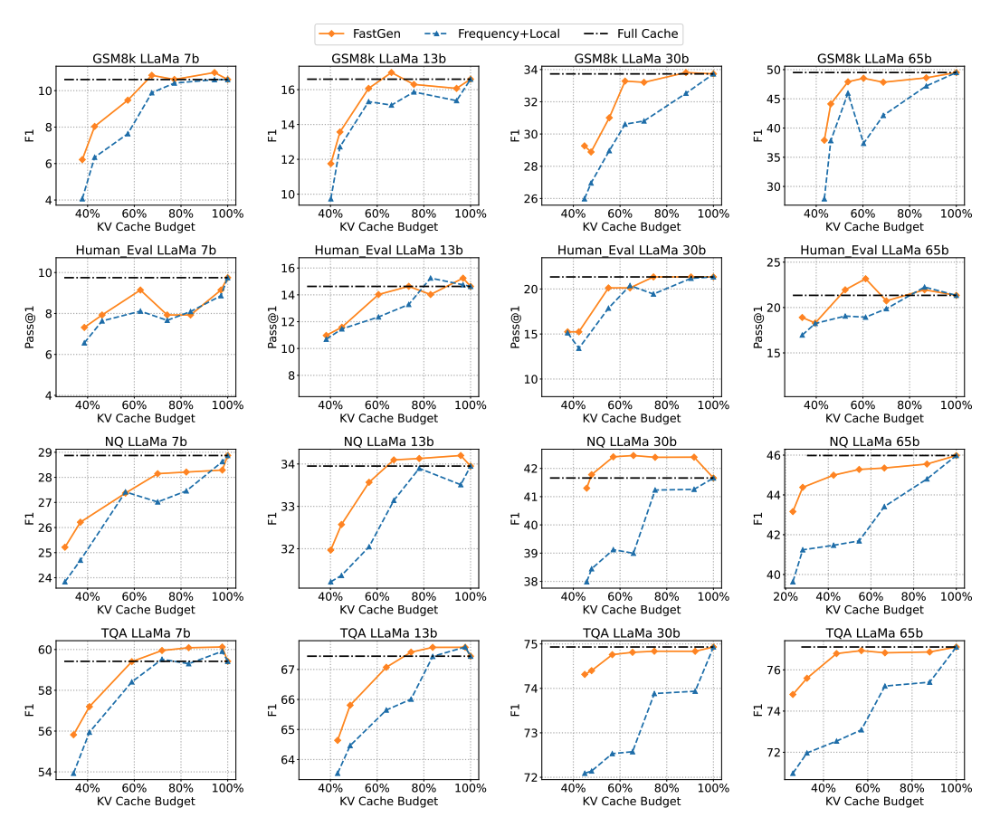
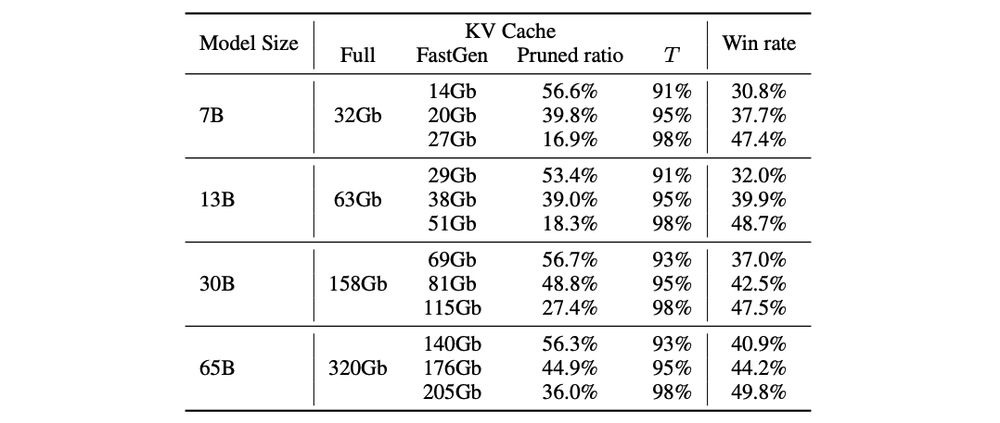
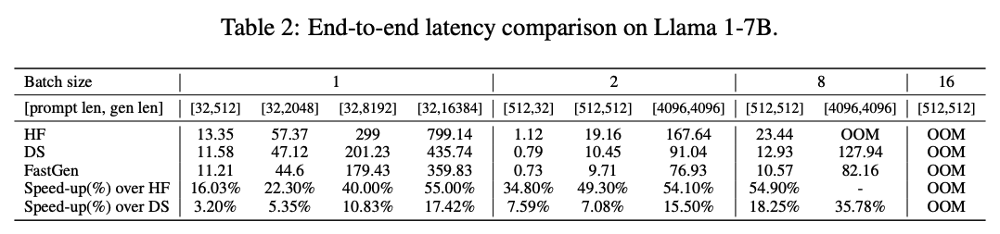
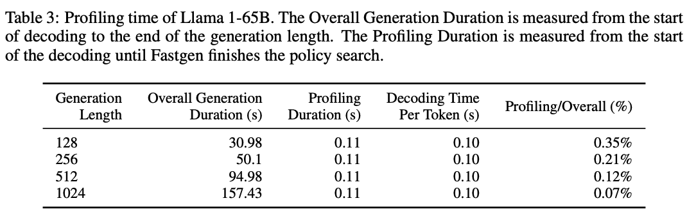
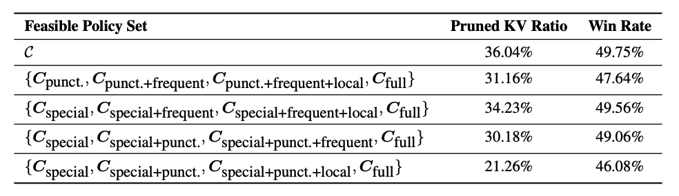
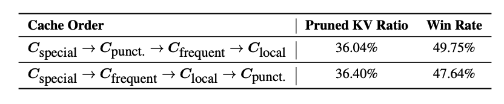
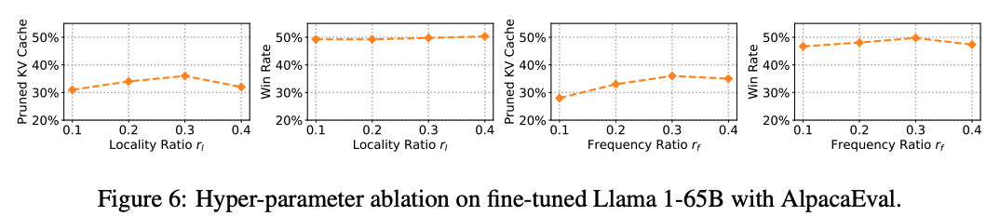

#모델이 버릴 것을 알려줍니다: LLM을 위한 적응형 KV 캐시 압축

SuyuGe1∗,YunanZhang1∗,LiyuanLiu2∗,MinjiaZhang2,JiaweiHan1,JianfengGao2
1UniversityofIllinoisUrbana-Champaign,2Microsoft
{suyuge2,yunanz2,hanj}@illinois.edu
{lucliu,minjiaz,jfgao}@microsoft.com

#요약
이 연구에서는 대형 언어 모델(LLM)의 생성 추론에 대한 메모리 사용량을 줄이는 플러그 앤 플레이 방식인 적응형 KV 캐시 압축을 소개합니다. 기존의 KV 캐시가 모든 컨텍스트 토큰에 대한 키와 값 벡터를 유지하는 것과 달리, 우리는 주의 모듈의 본질적인 구조를 파악하기 위해 목표 지향적인 프로파일링을 수행합니다. 인식된 구조를 바탕으로, 우리는 FastGen을 제안합니다. 이는 KV 캐시를 적응형으로 구성합니다: 지역 컨텍스트를 강조하는 주의 헤드에서 장거리 컨텍스트를 제거하고, 특수 토큰 중심의 주의 헤드에서 비특수 토큰을 버리며, 모든 토큰에 대해 넓게 주의를 기울이는 주의 헤드에 대해서만 표준 KV 캐시를 사용합니다. 또한, 적응형 KV 캐시 구성을 안내하는 경량 주의 프로파일링을 사용하여, FastGen은 자원 집약적인 미세 조정이나 재학습 없이 배포될 수 있습니다. 우리의 다양한 실험에서, FastGen은 GPU 메모리 사용량을 크게 줄이면서 생성 품질 손실은 무시할 수 있는 수준으로 보여줍니다. 우리는 재현성을 위해 우리의 코드와 호환되는 CUDA 커널을 공개할 예정입니다.

#1. 서론

Transformer 아키텍처를 기반으로 한 자동 회귀 언어 모델은 광범위한 주목을 받았습니다(OpenAI, 2023; Touvron et al., 2023b). 모델 크기가 증가함에 따라 이러한 모델은 계산 복잡성과 GPU 메모리 소비 측면에서 중요한 도전을 제시합니다(Shazeer et al., 2017). 이러한 모델이 다양한 애플리케이션에서 뛰어난 성공을 거두었기 때문에, 이러한 모델을 경제적으로 실행할 수 있는 방법이 절실하게 필요합니다.

LLM의 생성 추론은 일반적으로 생성 속도를 향상시키기 위해 KV 캐시 메커니즘을 사용하는 것을 포함합니다. KV 캐시는 주의 계산에서 이전에 계산된 키/값 벡터를 저장하고 현재 토큰 생성을 위해 이러한 값을 재사용합니다. 따라서, 이는 추가 메모리 소비를 비용으로 하여 각 토큰 생성 단계에서 이전 토큰의 재계산을 피합니다. 뛰어난 기술임에도 불구하고, 모델 크기와 생성 길이가 증가함에 따라 KV 캐시의 메모리 소비는 급격히 증가하여 기기 메모리에 대한 압박을 크게 증가시킵니다.

메모리 사용량이 GPU 용량을 초과할 때, LLM의 생성 추론은 일반적으로 오프로딩을 사용합니다(Aminabadi et al., 2022; Sheng et al., 2023). 이러한 방법들은 KV 캐시를 사용하여 희소한 GPU 메모리에 대한 압박을 완화하는 데 도움이 되지만, 많은 기기에서 GPU와 CPU 사이의 제한된 PCIe 대역폭으로 인해 KV 캐시를 CPU/NVM에 오프로딩하는 것은 여전히 생성 추론 성능에 상당한 오버헤드를 추가할 수 있습니다. 따라서, 비용이 많이 드는 재학습이나 미세 조정 없이 KV 캐시의 메모리 사용량을 줄이는 것이 중요한 과제가 되었습니다.

우리의 연구는 주의 모듈에서 관찰되는 풍부한 구조(Figure 1)에서 시작합니다(Micheletal.,2019;Voitaetal.,2019;Clarketal.,2019;Wangetal.,2020;Child et al., 2019), 그리고 모든 주의 모듈이 모든 토큰에 주의를 기울일 필요는 없다는 관찰(Liu et al., 2023b; Zhang etal.,2023;Liuetal.,2023a)에서 시작합니다. 직관적으로, 이러한 구조를 활용하고 캐시된 벡터를 압축하면 메모리 소비를 크게 줄이고 텍스트 생성을 가속화할 수 있습니다.

이러한 직관에 기반하여, 우리는 FastGen을 제안합니다. 이는 적응적으로 KV 캐시를 압축하여 생성 추론을 가속화합니다. 먼저, 우리는 attention 모듈의 구조적 패턴을 인식하기 위해 효율적인 프로파일링 알고리즘을 사용합니다. 이 프로파일링의 지침에 따라, 우리는 다양한 모듈에 대한 KV 캐시를 적응적으로 구성합니다. 이러한 진단 전 압축 접근법을 통해, FastGen은 모델 품질을 유지하면서 KV 캐시의 메모리 사용량을 효과적으로 줄입니다.

![[Model Tells You What to Discard- Adaptive KV Cache Compression for LLMs/image.png]]

그림 1: 다른 attention head는 일반적으로 다른 구조를 가지고 있습니다. 왼쪽: 네 가지 일반적인 attention 구조(섹션 3과 섹션 4에서 자세히 설명됨). 오른쪽: 같은 레이어에 있는 세 개의 attention head의 attention map 구성.

![[Model Tells You What to Discard- Adaptive KV Cache Compression for LLMs/image-1.png]]

그림 2: 적응적 KV 캐시(FastGen)와 고정 KV 캐시(Frequency, Local, and Frequency+Local; Zhang et al., 2023 and Liu et al., 2023a)의 AlpacaEval에서의 성능.

우리의 연구에서, FastGen은 다섯 가지 기본 attention 구조를 인식하고 이에 따라 적용합니다. 특히, 일부 attention 모듈은 주로 로컬 컨텍스트에 주의를 기울이며, 이에 대해 우리는 장거리 컨텍스트를 제거하는 KV 캐시를 구성합니다. 일부는 주로 특정 토큰/구두점에 주의를 기울이며, 이에 대해 우리는 특수 토큰/구두점만을 유지하는 KV 캐시를 생성합니다. 일부는 열별로 희소한 attention map을 가지며, 이에 대해 우리는 가장 적게 주의를 받는 토큰을 제거합니다. 그리고 일부는 모든 토큰에 넓게 주의를 기울이며, 이에 대해 우리는 표준 KV 캐시를 사용하고 모든 토큰을 저장합니다.

이런 방식으로, FastGen은 KV 캐시를 압축하면서 attention 모듈의 원래 기능을 유지할 수 있습니다. 놀랍게도, FastGen은 어떠한 fine-tuning도 필요로 하지 않으며, plug-and-play 방식으로 적용할 수 있습니다. 이는 FastGen의 큰 장점으로, 매우 큰 모델들의 훈련 비용(Brown et al., 2020)은 많은 연구소나 실무자들이 감당하기 어렵습니다. 우리는 Llama1(Touvron et al., 2023b)에서 FastGen을 수학, 코드, 지식, 상식 추론 등의 주요 벤치마크를 포함하는 생성 작업에 대해 평가합니다. FastGen은 KV 캐시 압축을 효과적으로 수행하며, 생성 품질 손실은 무시할 수 있을 정도입니다(즉, 캐시 압축 35%에 대해 attention 점수의 95% 이상을 회복). 특히, 그림 2의 30b 모델에서는 FastGen(50% 캐시 압축)이 모든 고정 KV 압축 방법(15% 캐시 압축)을 능가합니다.

#2 관련 연구

토큰 드롭 및 KV 캐시 압축. LLMs의 모델 효율성을 향상시키기 위해 많은 노력이 기울여졌습니다. 순환 신경망에 대해, 한 시간 단계에서 여러 토큰을 건너뛰는 방법이 있습니다(Campos et al., 2017; Seo et al., 2017; Hansen et al., 2019). Transformer 모델이 빠르게 주목을 받자, Goyal et al.(2020)은 BERT(Devlin et al., 2019)에서 attention 점수에 기반하여 불필요한 단어를 제거하도록 제안하였고, Dai et al.(2020)은 transformer 아키텍처의 인코딩 모듈에 풀링 레이어를 추가하여 입력 시퀀스를 압축합니다. 최근에는, Huang et al.(2022)은 원래의 BERT 모델에 성능 중요 토큰을 선택하는 작업을 추가하였고, Kim et al.(2022)은 중요하지 않은 토큰을 제거하기 위한 학습 가능한 임계값을 설계하였습니다. 한편, 토큰의 숨겨진 상태를 압축하는 가능성을 탐색하기 위해 많은 노력이 기울여졌습니다(Guan et al., 2022; Sun et al., 2022; Zhou et al., 2020).

그러나, 이러한 방법들은 비자기회귀 모델에만 적용될 수 있으며, 일반적으로 추가적인 재훈련 단계를 필요로 하므로, ChatGPT와 Llama와 같은 자기회귀 LLMs에는 적합하지 않습니다. 이러한 차이를 인식하고, 연구자들은 자기회귀 LLMs의 KV 캐시 내의 토큰을 제거하는 가능성을 검토하기 시작했습니다. Mu et al.(2023)은 캐싱 중 메모리 압박을 줄이기 위해 프롬프트를 몇 개의 특수 토큰으로 압축하는 방법을 학습합니다. 그러나, 토큰 예측은 모델 재훈련을 필요로 하며, 추론 중에 비용이 많이 드는 overhead가 될 수 있습니다. 한편, 몇 가지 동시 방법들은 KV 캐시 내의 중요 토큰을 식별하는 기준으로 누적된 attention 점수를 활용하도록 제안합니다(예: Sheng et al., 2023; Zhang et al., 2023; Liu et al., 2023a). 특정 추방 정책을 조사하는 대신, 이 연구는 모델 특정 속성과 더 잘 조화되도록 다양한 추방 정책을 협력적으로 조정하는 것을 목표로 합니다.

Attention의 기본 구조. Transformer의 성공에 영감을 받아, 다양한 self-attention 헤드의 기본 메커니즘을 탐색하기 위한 광범위한 연구가 수행되었습니다. Voita et al.(2019)은 LRF(Bach et al., 2015)를 사용하여 BERT의 self-attention 헤드를 분석하고, 그 중 하나는 항상 인접한 토큰에 주의를 기울이는 것으로 해석 가능한 역할로 분류하였습니다. Michel et al.(2019)은 같은 레이어의 헤드가 성능에 다른 영향을 미칠 수 있으며, 각 헤드의 중요성이 작업에 따라 변한다는 것을 보여주었습니다. Clark et al.(2019)과 Kovaleva et al.(2019)은 일부 헤드가 주로 구분자 토큰, 인접 토큰, 그리고 이들의 조합에 주의를 기울인다는 패턴을 확인하였습니다. 대부분의 이전 연구들이 주로 인코더 모델을 고려하였지만, FastGen은 디코더 전용 모델에서 관찰한 일관된 패턴에 의해 동기를 부여받았습니다. 이전 연구와 마찬가지로, FastGen은 추론 효율성을 향상시키기 위해 attention 메커니즘의 구조를 탐색합니다. 그러나 FastGan은 다른 attention 헤드의 KV 캐시를 특성화하는 데 초점을 맞추어 이전 연구와 차별화됩니다.

#3 적응형 KV 캐시 압축

이 섹션에서는 먼저 문제 정의를 소개하고, attention 프로파일링과 적응형 KV 캐시 압축을 제시합니다.

##3.1 자기회귀 LLMs의 생성 추론

일반적인 생성 모델 추론은 두 단계를 포함합니다: 프롬프트 인코딩과 토큰 생성.

프롬프트 인코딩. 자기회귀 트랜스포머 기반 LLM이 i번째 토큰을 생성할 때, attention 모듈은 이전의 i-1 토큰들로부터 문맥 정보를 수집해야 합니다. 즉, 이 토큰들의 키와 값 벡터(KV 벡터)를 수집해야 합니다. 후속 토큰을 생성할 때 중복된 KV 벡터 계산을 피하기 위해, 생성된 KV 벡터들은 모두 KV 캐시에 저장됩니다.

토큰 생성. 프롬프트 인코딩이 완료되면, LLM은 토큰을 하나씩 생성합니다. 각 생성 단계에서, LLM은 이전 단계에서 생성된 새로운 토큰을 인코딩해야 합니다. 새로운 토큰이 생성되면, 그에 연관된 KV 벡터들은 현재의 KV 캐시에 추가됩니다. 따라서, KV 캐시의 크기는 생성되는 토큰의 수에 선형적으로 증가합니다.

##3.2 FASTGEN
2장에서 설명했듯이, 이전의 많은 연구들은 LLM의 복잡한 attention 구조를 활용하지 않고 KV 캐시를 압축하여 추론 효율성을 향상시키려 했습니다. 4장에서 자세히 설명하겠지만, LLM의 attention 헤드들은 종종 독특한 기능을 수행하므로, 각 개별 attention 헤드에 맞게 압축 전략을 맞추는 것이 필요합니다.

이러한 통찰을 바탕으로, 우리는 FastGen을 소개합니다: 적응형 KV 캐시를 만들기 위한 이중 단계 알고리즘입니다. 프롬프트 인코딩 단계에서는, 모델 프로파일링이 수행되어 다양한 attention 헤드의 동작을 파악하고, 각 헤드에 가장 적합한 압축 전략을 선택할 수 있습니다. 그 다음, 토큰 생성 단계에서는, 새로 생성된 토큰마다 새로운 KV 벡터를 무차별적으로 추가하는 대신, 선택된 압축 전략에 따라 각 토큰의 KV 캐시를 관리합니다.

##3.3 모델 프로파일링
모델 프로파일링은 프롬프트 인코딩의 결과에 기반하여 수행됩니다. 특히, 압축 정책 C에 대해, 해당 KV 캐시 압축을 K, V = f(K, V, C)로 표시하며, 여기서 K와 V는 압축된 KV 캐시입니다. 그런 다음, attention 맵 A = softmax(QKT)에 대해, 최소 메모리 비용으로 A를 복구할 수 있는 최적의 정책을 선택합니다:

$$C^* = \arg\min_{C \in C} \text{CacheMemoryCost}(C) \quad \text{s.t.} \quad |A - \text{softmax}(QK_TC)| \leq 1 - T, \quad (1)$$

여기서 C는 모든 실행 가능한 압축 정책의 집합이며, CacheMemoryCost(C)는 압축 정책 C의 목표 KV 캐시 예산이며, T는 얼마나 많은 정책이 A를 복구하길 원하는지를 나타내는 사전 정의된 하이퍼파라미터입니다. 5장에서 논의할 것처럼, FastGen은 65B 모델에 대해 압축 비율이 +40%인 attention 맵의 +95%를 복구할 수 있습니다. 모델 프로파일링을 포함한 최종 프롬프트 인코딩 알고리즘은 알고리즘 1에서 제시됩니다.

본질적으로, 우리의 방법은 attention 맵의 구조가 다른 attention 헤드들에서 다른 위치에서 안정적이라고 가정합니다. 따라서, 인코딩된 프롬프트만 사용하여 적절한 압축 정책을 선택하는 것이 충분합니다. 기존의 문헌에서는 전체 컨텍스트에 대한 attention 구조를 포착하기 위해 인코딩된 프롬프트만 사용하는 것에 대한 이론적 근거를 제공하였습니다(Zhang et al., 2023; Liu et al., 2023a). 우리의 연구에서도 이를 경험적으로 검증하였으며, 이에 대해서는 4장에서 자세히 설명하겠습니다.

##3.4 KV 캐시 압축 정책
우리의 실험에서는 많은 수의 attention 헤드들이 특정 패턴을 밀접하게 따르는 것을 관찰했습니다. 따라서, 기존의 전체 KV 캐시 정책 외에도, 우리는 네 가지 기본 KV 캐시 압축 정책을 고려합니다. 이 연구에서는 주로 이 네 가지 기본 KV 캐시 압축 정책을 평가에 사용하지만, FastGen이 다수의 다른 전략을 사용하는 것은 쉽습니다. 네 가지 KV 캐시 압축 정책은 다음과 같습니다:

• 특수 토큰. 우리는 KV 캐시에 문장의 시작 토큰인 <s>, 지시 토큰인 [INST] 등과 같은 특수 토큰만 유지합니다. 이 정책은 C_special로 참조됩니다.
• 구두점. 우리는 KV 캐시에 "." , ":" , "?"와 같은 구두점 토큰만 유지합니다. 이 정책은 C_punct.로 참조됩니다.

• 지역성: 이 정책은 장거리 컨텍스트를 제거합니다. 컨텍스트 토큰과 현재 토큰 사이의 상대적 거리가 임계값을 초과하면, 컨텍스트 토큰의 KV 캐시가 제거됩니다. 이 임계값은 지역 컨텍스트의 길이 예산과 입력 시퀀스 길이의 사전 정의된 비율 r에 의해 결정됩니다. 이 정책은 C_local로 참조됩니다.

• 빈도 (Heavy Hitter): 이 정책은 이전의 여러 연구에서 사용되었습니다 (예: Sheng et al., 2023; Zhang et al., 2023; Liu et al., 2023a). 우리는 각 토큰의 누적 attention 점수를 모니터링하고, 이 점수를 토큰 빈도로 취급하여 KV 캐시에서 가장 빈번한 토큰만 유지합니다. 빈번한 토큰의 길이 예산은 현재 시퀀스 길이에 대한 비율 r에 의해 제어됩니다. 이 정책은 C_frequent로 참조됩니다.

하이브리드 정책: 실제로는 앞서 언급한 압축 정책을 결합한 하이브리드 정책을 사용하는 것이 종종 필요합니다. 하이브리드 정책의 총 수가 매우 많기 때문에, 우리의 연구에서는 다음과 같이 탐욕적인 방법을 사용하여 하이브리드 정책의 작은 집합을 구성합니다: C = {C_special, C_special+punct., C_special+punct.+frequent, C_special+punct.+frequent+local, C_full}, (2) 여기서 두 압축 전략의 합은 그들의 압축된 KV 캐시의 합집합을 계산하고, C_full은 압축 없이 전체 KV 캐시를 참조합니다.

우리는 두 가지 이유로 모든 하이브리드 정책에서 C_special을 구성 요소로 사용합니다: 1) 우리는 높은 attention 점수가 일반적으로 C_special에 할당되는 것을 관찰하였습니다. 이는 섹션 4에서 자세히 설명될 것입니다. 이는 C_special이 attention 맵 복구에 중요하다는 것을 나타냅니다. 2) C_special의 압축 캐시는 메모리 효율적입니다. 왜냐하면 한 문장에 특수 토큰이 일반적으로 5개 미만이기 때문입니다. 다시 말해, 항상 C_special을 포함함으로써 추가 메모리 비용이 거의 없거나 전혀 없습니다. 마찬가지로, C_punct.는 메모리 효율성 때문에 하이브리드 정책을 형성하는 구성 요소로 자주 사용됩니다. 즉, 한 문장에 있는 구두점의 수가 작습니다. 토큰 생성을 위한 최종 알고리즘은 알고리즘 2에 제시되어 있습니다.

#4 ATTENTION 구조의 다양성과 안정성

이 섹션에서는 적응형 KV 캐시 압축의 효과성을 보여주기 위한 경험적 연구를 제시합니다. 먼저, 다른 attention 헤드가 일반적으로 고유한 구조를 가지고 있다는 것을 보여줍니다. 그런 다음, 이러한 attention 헤드 구조가 다른 attention 헤드의 다른 위치에서 상대적으로 일관되게 유지된다는 것을 보여줍니다. 우리는 이를 GSM8k (Cobbe et al., 2021)에서 무작위로 추출한 샘플을 사용하여 Llama165B의 attention 점수를 분석함으로써 수행합니다.

##4.1 헤드 별 고유 ATTENTION 구조

설정: 우리는 복구 임계값 0.95로 모델 프로파일링을 수행하고 {1,10,20,30,40,50,60,70,80} 레이어의 프로파일링 결과 분포를 계산합니다. 결과는 그림 3에 표시되어 있습니다.

관찰. 그림 3은 다른 계층의 attention heads가 크게 다른 구조를 가지고 있다는 것을 보여줍니다. 특히, 초기 및 최종 계층에서는 전체 KV 캐시에 더 많은 attention heads가 할당되어 있음을 나타내며, 이는 이러한 계층의 attention heads가 모든 토큰에 주의를 기울일 가능성이 높음을 나타냅니다. 한편, 중간 계층에서는 attention map이 특수 토큰에 초점을 맞추고 있어, 이러한 계층의 대부분의 attention heads가 주로 특수 토큰에 주의를 기울인다는 것을 나타냅니다(즉, 특수 토큰에 대한 누적 attention 점수가 이러한 attention heads에 대해 0.95보다 높습니다). 그림 1은 같은 계층의 다른 attention heads의 구조를 보여줍니다. 우리는 attention 구조가 다른 계층과 다른 heads에서 다르다는 것을 볼 수 있습니다. 이러한 결과는 모든 계층에 동일한 KV 캐시를 적용하는 것이 최적이 아니며, 각 attention head의 구조를 감지하여 최적의 압축 정책을 선택하여 KV 캐시를 구성하는 것이 유익하다는 것을 나타냅니다.

##.2 프로필은 한 시퀀스에서 일관되게 유지되는 경향이 있습니다
이전 섹션에서는 다른 attention heads의 구조에 따라 적응형 KV 캐시를 구성하는 데 큰 잠재력이 있음을 보여주었습니다. 여기서는 사용자가 제공한 프롬프트만을 활용하고 섹션 3.3에서 설명한 대로 일회성 모델 프로파일링을 수행하는 것이 충분하다는 것을 보여줍니다. 특히, 사용자가 제공한 프롬프트가 생성 과정에서 동일한 attention 구조를 공유한다는 것을 보여줍니다.

![[image-3.png]]

설정. 그림 1에 따라, 우리는 Llama165B의 다른 계층에서 attention heads에 대한 누적 attention 점수를 여러 디코딩 단계(즉, 1번째, 10번째, 20번째, 30번째)에서 계산합니다. 우리는 그림 4에서 결과적으로 누적된 점수를 시각화했습니다.

관찰. 시간 단계에 따른 누적 attention 점수의 일부 변동에도 불구하고, attention 맵의 패턴은 상대적으로 안정적으로 유지됩니다. 예를 들어, Layer 33 Head 0과 Layer 23 Head 2는 거의 특수 토큰에만 주의를 기울이는 반면, Layer 23 Head 0에서는 지역성과 구두점이 중요한 역할을 합니다. Layer 23 Head 3에 대해서는 attention 점수의 10% 이상이 다른 부분에 할당되어 있어, 이는 압축되지 않은 KV 캐시 C에 적합합니다.
또한, 우리는 모든 경우에서 특수 토큰에 대한 큰 부분의 attention 점수를 관찰했습니다. 이는 섹션 3.4에서 설명한 대로 하이브리드 정책을 구성하기 위해 우리가 사용한 탐욕적 방법을 정당화합니다.

#5 실험
FastGen의 메모리 사용량 감소와 생성 품질 유지에 대한 효과를 입증하기 위해 포괄적인 실험을 수행했습니다. 먼저, 섹션 5.1에서 메모리 감소와 end-to-end 생성 품질 간의 트레이드오프를 보고하고, 섹션 5.2에서 FastGen의 압축 비율을 논의합니다. 실제 시스템에서 FastGen의 우월성을 입증하기 위해, 섹션 5.3에서 end-to-end 지연 시간 변화를 보여주고, 섹션 5.4에서 프로파일링 오버헤드를 보여줍니다. 마지막으로, 섹션 5.5에서 Ablation 연구와 논의를 제시합니다.

##5.1 성능과 메모리 감소 간의 트레이드오프

그림 5: GSM8k, HumanEval, NQ, 그리고 TQA에서의 Llama1의 Adaptive KV Cache (FastGen)와 Fixed KV Cache (Frequency+Local; Zhang et al., 2023 and Liu et al., 2023a)의 성능.

Backbones. 우리는 Llama1 (Touvron et al., 2023a)과 그것의 fine-tuned 변형 모델들을 사용하여 실험을 수행했습니다. 이 모델들의 크기는 7B에서 65B까지 다양합니다. Fine-tuned 변형 모델들에 대해, 우리는 그룹화된 쿼리 주의 기법 때문에 오픈 소스 Llama 2-chat (Touvron et al., 2023b) 모델을 선택하지 않았습니다. 대신, 이 연구에서는 원래의 multi-head attention 아키텍처를 사용하고 그룹화된 쿼리 주의의 통합을 미래의 작업으로 남겨두었습니다. 비교 가능한 instruction-following 모델을 준비하기 위해, 우리는 오픈 소스 instruction-tuning 데이터셋을 사용하여 Llama1 모델을 fine-tuned 했습니다. 특히, fine-tuned 변형 모델들은 LIMA1 데이터(Zhou et al., 2023)와 Open Assistant2(Ko¨pf et al., 2023) 데이터에서 훈련되었습니다.

Tasks. 우리는 표준 생성 작업을 사용하여 Llama 1과 우리의 fine-tuned Llama 1 모델들을 평가합니다. Llama 1의 경우, 우리는 HumanEval (Chen et al., 2021)을 포함한 네 가지 다른 작업을 선택했습니다.

GSM8k (Cobbe 등, 2021), NQ (Kwiatkowski 등, 2019) 및 TQA (Kembhavi 등, 2017)를 사용하여 모델의 다양한 도메인(코드, 수학, 질문 응답 및 독해)에 대한 능력을 평가합니다. 이 네 가지 작업에서 각 테스트 샘플은 생성 형식이며, 모델 생성이 완료된 후에 답변이 추출됩니다. 이는 모델의 생성 품질에 대한 공정한 비교를 위해 중요합니다. 우리는 지시사항을 미세조정한 LLaMa 모델을 다양한 도메인에서 805개의 질문 프롬프트로 구성된 지시사항 튜닝 벤치마크인 AlpacaEval(Li 등, 2023)에서 평가합니다.

실험 설정. Llama 1 모델의 평가는 각 벤치마크에서의 기본 설정과 평가 지표를 따릅니다. GSM8k, NQ 및 TQA에 대해 F1 점수를 계산하고, HumanEval에 대해 코드 실행 Pass@1 비율을 사용합니다. 지시사항 튜닝 모델을 평가하는 것은 여전히 도전적이지만, 이전의 작업(Zhou 등, 2023; Touvron 등, 2023b)을 따라 GPT4를 두 개의 다른 모델 생성 사이의 쌍별 비교를 위한 평가자로 사용합니다. 각 프롬프트에 대해, FastGen 생성과 동일한 모델에서 Full KV Cache를 사용한 생성을 쌍으로 입력하고, GPT4에게 어느 것이 더 나은지 판단하도록 요청합니다. 그런 다음 FastGen이 Full Cache를 이긴 승률을 계산합니다. 가설적으로, 손실 없는 방법의 승률은 약 50%가 되어야 합니다. 전체 캐시 모델 외에도, 우리는 비적응적 KV 캐시 방법을 비교를 위해 포함합니다. 특히, 우리는 모든 주의 헤드에 대해 어떠한 적응도 없이 C, C, C를 적용합니다. 이는 매우 강력한 기준선이며, 이는 H O 방법(Zhang 등, 2023)과 Scissorhands 방법(Liu 등, 2023a)과 동일합니다. 우리는 $$r_l = 0.3$$, $$r_f = 0.3$$을 설정하고, 가지치기된 KV 캐시 비율을 제어하기 위해 복구 비율 T만 변경합니다. 생성을 위해, 우리는 핵 샘플링(Holtzman 등, 2019)을 사용하고, 온도 T=0.6, p=0.9로 설정합니다. 실험은 8개의 NVIDIA A100 80GB GPU에서 수행됩니다.

주요 결과. 그림 2와 그림 5에서, 우리는 KV 캐시 예산이 30%에서 100%로 증가함에 따른 모델 품질을 보여줍니다. 30B 모델의 경우, FastGen(50% 캐시 압축)은 모든 비적응적 KV 압축 방법(15% 캐시 압축)을 능가합니다. 또한, FastGen이 모델 크기가 증가함에 따라 더 많은 KV 캐시 감소 비율을 달성하면서 동일한 모델 품질을 유지하는 것을 볼 수 있습니다. 예를 들어, 45%의 승률을 달성하면, FastGen은 Llama 1-65B에서 최대 44.9%의 가지치기 비율을 얻을 수 있습니다. 이는 Llama 1-7B에서의 16.9% 가지치기 비율과 비교됩니다. 모든 설정에서, FastGen은 비적응적 압축 방법에 비해 일관되고 유의미한 개선을 보여줍니다. 이 결과는 FastGen을 사용한 적응적 KV 캐시 압축의 효과성을 입증합니다, 그것의 단순함에도 불구하고.

표1: FastGen에 의한 메모리 사용량 감소. 우리는 전체 KV 캐시를 가진 모델과 FastGen으로 압축된 모델 사이의 메모리 사용량을 비교했습니다.

##5.2 메모리 사용량 감소 분석

표 1에서 KV 캐시 메모리 사용량 감소를 보고합니다. 모든 평가된 7B-65B 모델에 대해, 우리는 고정 배치 크기 16, 시퀀스 길이 512, 그리고 fp16 형식의 모델 가중치를 가진 메모리 사용량을 평가합니다. 우리는 FastGen이 모든 모델 크기에서 KV 캐시 메모리 사용량을 크게 줄이는 것을 관찰하였으며, 더 큰 모델에서 더욱 두드러진 감소를 보였습니다.

FastGen은 품질 저하가 거의 없는 상태에서 45% 이상의 승률을 달성할 수 있으며, Llama1-65B에서 약 40%의 메모리 감소, Llama1-30B에서 약 30%, Llama1-13B와 Llama1-7B에서 약 20%의 메모리 감소를 달성할 수 있습니다.

##5.3 종단간 지연시간 개선

FastGen의 종단간 속도 향상을 분석하기 위해, 전체 캐시 설정과 강력한 모델 가속 기준에 대한 종단간 지연시간 개선을 제시합니다. 실험에서는 프롬프트 인코딩 시작부터 생성 종료까지의 총 시간을 종단간 지연시간으로 측정했습니다. 전체 캐시 기준으로는 널리 사용되는 Hugging Face Accelerate(HF)를 채택하였으며, 이는 표2에서 HF로 표시되었습니다. FastGen의 경우, KV 캐시 프루닝 작업을 처리하기 위해 맞춤형 커널을 구현했습니다. 특히, KV 캐시 희소성 작업을 추가하여 Deepspeed(DS)의 커널을 적용했습니다. 공정한 비교를 위해 Deepspeed 성능도 포함하였으며, 이는 표2에서 DS로 표시되었습니다. 모든 방법은 동일한 Nvidia V100 GPU에서 테스트되었습니다.

표2에서 볼 수 있듯이, FastGen은 모든 생성 설정에서 중요한 종단간 속도 향상을 달성합니다. 가장 덜 중요한 경우에서도, FastGen은 512의 짧은 생성 길이에서 HF 기준에 대해 16.04%의 지연시간 개선을 달성할 수 있습니다. 최선의 경우에서는, 16k의 생성 길이에서 FastGen으로 HF에 대해 최대 55.0%의 지연시간 감소를 달성할 수 있습니다. 생성 길이가 길어질수록 상대적인 속도 향상이 더 크다는 것을 알 수 있습니다. 예를 들어, 배치 크기가 1인 경우, FastGen의 상대적인 속도 향상은 생성 길이가 512에서 16k로 증가함에 따라 16.04%에서 55.0%로 상승합니다. FastGen과 DeepSpeed를 비교할 때도, 배치 크기와 생성 길이가 커짐에 따라 상당한 속도 향상을 관찰할 수 있습니다. DeepSpeed는 전체 스택이 최적화된 추론 시스템이므로, 주의 계산이 최적화되는 것뿐만 아니라, 희소성 커널을 개선함으로써 FastGen을 더욱 개선할 수 있는 여지가 많이 있습니다. 이 독특한 연구 및 엔지니어링 도전을 미래의 작업에 남겨둡니다.

##5.4 프로파일링 비용

프로파일링 단계의 오버헤드를 더 잘 이해하기 위해, 다양한 생성 길이에 걸쳐 프로파일링 시간과 총 생성 시간을 비교합니다. 결과는 표3에 제시되어 있습니다.

프로파일링 시간은 총 생성 시간의 매우 작은 부분만을 차지하며, 테스트된 경우에서 최대 0.35%에 불과합니다. 또한, 생성 길이가 증가함에 따라 오버헤드가 감소하며, 생성 길이가 1024일 때 0.07%로 떨어집니다.

추가 메모리 사용량은 주로 압축 전략 중 하나인 C에 의해 도입되며, 이는 각 주의 헤드에 대한 주의 점수의 누적 합계를 저장해야 합니다. 자세한 분석을 제공하기 위해, 각 계층의 차원은 9입니다.

표 4: 각 정책의 보완적 효과. 우리는 각 방법의 승률을 전체 캐시 설정에 대해 표시합니다. 우리는 같은 매개변수로 AlpacaEval에서 미세 조정된 Llama1-65B를 평가합니다.

표5: AlpacaEval에서 미세 조정된 Llama1-65B에 대한 정책 순서 제거.

KV 캐시의 차원은 (배치 크기, 헤드 수, 시퀀스 길이, 히든 차원)이며, 누적 attention 점수를 위한 추가 메모리의 차원은 (배치 크기, 헤드 수, 시퀀스 길이)입니다. 모든 모델 크기에 대해 히든 차원 = 128을 고려하면, 메모리 오버헤드는 KV 캐시만 저장하는 것에 비해 1/128 = 0.78%로, 무시할 수 있는 비용입니다.

##5.5 ABLATIONS
모든 제거 실험에서, 우리는 고정된 복구 비율 T=0.98을 사용합니다.

하나의 정책이 모든 다른 정책에 어떤 영향을 미치는가? 우리는 각 정책의 보완적 효과를 우리의 프레임워크에서 모든 다른 정책의 조합에 대해 연구합니다. 우리는 복구 비율 T를 고정하면서 pruned KV 캐시와 승률의 변화를 검토합니다. 우리는 전체 정책 세트를 우리의 대조 세트 C로 취합니다. 각 제거 실험에서, 우리는 C에서 모든 정책 조합 중 하나의 정책을 제거합니다. 우리는 표 4에서 결과를 요약하였는데, 이는 C와 C가 가장 중요한 정책이라는 것을 제안합니다. 그들을 제거하면 각각 3.67%와 2.11%의 승률 하락이 발생합니다. 우리는 또한 pruned 캐시 비율에서 C와 C가 다른 것들보다 더 많은 KV 캐시를 줄인다는 것을 관찰할 수 있습니다. 그러나, 그들의 단독 비적응적 배치는 최적이 아닌 성능을 보여주며, 그림 2에서 보여주는 것처럼 다른 압축 정책을 적용하는 것의 중요성을 더욱 확인합니다.

어떤 정책을 먼저 추가해야 하며 (마지막에 추가해야 하는가)? 섹션 3.4에서와 같이, 우리는 탐욕적인 방법을 사용하여 적응형 KV 캐시를 구성합니다. 여기서, 우리는 각 정책을 도입하는 순서가 성능에 어떤 영향을 미치는지 검토합니다. 이전 연구와 비슷하게, 우리는 복구 비율을 0.98로 고정하고, 구성된 캐시가 복구 비율에 도달할 때까지 캐시 예산을 계속 할당합니다. 간단하게 하기 위해, 우리는 모든 검토된 순서가 일반적으로 가장 중요한 토큰이며, 그림 1에서 제안된 것처럼 매우 낮은 메모리 비용인 C를 먼저 선택하도록 합니다. 우리는 표 5에서 결과를 요약합니다. 우리의 현재 순서(방정식 2에서와 같이)는 가장 높은 승률과 가장 높은 제거 비율을 달성합니다. 한편, 대체 순서를 사용하면 KV 캐시 압축과 생성 품질 사이의 다른 트레이드오프가 발생합니다. 예를 들어, C→ C→ Cpunct.를 사용하면 생성 품질을 희생하면서 개선된 KV 캐시 압축 비율을 얻을 수 있습니다.

민감도 연구. FastGen에 대한 다양한 하이퍼파라미터 선택의 민감도를 분석하였으며, 그 결과는 그림 6에 나타나 있습니다. 이러한 하이퍼파라미터를 변경해도 생성 품질에 눈에 띄는 영향을 미치지 않는 것으로 관찰되었으며, 모델은 모든 상황에서 45% 이상의 승률을 유지하였습니다. 한편, 이는 압축 비율에 상대적으로 큰 변화를 가져왔습니다. 예를 들어, 주파수 정책에 대한 비율을 0.3에서 0.1로 변경하면 KV 캐시가 더 많이 생성됩니다. 우리의 실험에서는 r과 l에 대한 비율을 모두 0.3으로 설정하였습니다.

#6 결론
우리는 FastGen이라는 새로운 방법을 제시하였습니다. 이 방법은 가벼운 모델 프로파일링과 적응형 키-값 캐싱을 사용하여 LLM의 추론 효율성을 크게 향상시키며, 눈에 띄는 품질 손실 없이 이를 달성합니다. 미래의 탐구 분야로는 FastGen을 양자화, 증류 등의 다른 모델 압축 기법과 결합하거나, 그룹화된 쿼리 주의 등의 효율적인 주의 구조와 결합하는 것이 있습니다.

참고문헌
Reza Yazdani Aminabadi, Samyam Rajbhandari, Minjia Zhang, Ammar Ahmad Awan, Cheng Li, DuLi, Elton Zheng, Jeff Rasley, Shaden Smith, Olatunji Ruwase, and Yuxiong He. Deepspeed-inference: Enabling efficient inference of transformer models at unprecedented scale. SC22: International Conference for High Performance Computing, Networking, Storage and Analysis, pp.1–15,2022.

Sebastian Bach, Alexander Binder, Gre´goire Montavon, Frederick Klauschen, Klaus-Robert Mu¨ller, and Wojciech Samek. On pixel-wise explanations for non-linear classifier decisions by layer-wise relevance propagation. PLoS ONE, 10, 2015.

Tom B. Brown, Benjamin Mann, Nick Ryder, Melanie Subbiah, Jared Kaplan, Prafulla Dhariwal, Arvind Neelakantan, Pranav Shyam, Girish Sastry, Amanda Askell, Sandhini Agarwal, Ariel Herbert-Voss, Gretchen Krueger, Tom Henighan, Rewon Child, Aditya Ramesh, Daniel M. Ziegler, Jeffrey Wu, Clemens Winter, Christopher Hesse, Mark Chen, Eric Sigler, Mateusz Litwin, Scott Gray, Benjamin Chess, Jack Clark, Christopher Berner, Sam McCandlish, Alec Radford, Ilya Sutskever, and Dario Amodei. Language models are few-shot learners. In Hugo Larochelle, Marc’Aurelio Ranzato, Raia Hadsell, Maria-Florina Balcan, and Hsuan-Tien Lin (eds.), Advances in Neural Information Processing Systems 33: Annual Conference on Neural Information Processing Systems 2020, NeurIPS 2020, December 6-12, 2020, virtual, 2020.

V´ıctor Campos, Brendan Jou, Xavier Giro´ i Nieto, Jordi Torres, and Shih-Fu Chang. Skip rnn: Learning to skip state updates in recurrent neural networks. ArXiv, abs/1708.06834, 2017.

Mark Chen, Jerry Tworek, Heewoo Jun, Qiming Yuan, Henrique Ponde de Oliveira Pinto, Jared Kaplan, Harri Edwards, Yuri Burda, Nicholas Joseph, Greg Brockman, et al. Evaluating large language models trained on code. arXiv preprint arXiv:2107.03374, 2021.

Rewon Child, Scott Gray, Alec Radford, and Ilya Sutskever. Generating long sequences with sparse transformers. CoRR, abs/1904.10509, 2019.

Kevin Clark, Urvashi Khandelwal, Omer Levy, and Christopher D. Manning. What does BERT look at? an analysis of BERT’s attention. In Proceedings of the 2019 ACL Workshop Black-box NLP: Analyzing and Interpreting Neural Networks for NLP, pp. 276–286, Florence, Italy, August 2019. Association for Computational Linguistics.

Karl Cobbe, Vineet Kosaraju, Mohammad Bavarian, Mark Chen, Heewoo Jun, Lukasz Kaiser, Matthias Plappert, Jerry Tworek, Jacob Hilton, Reiichiro Nakano, et al. Training verifiers to solve math word problems. arXiv preprint arXiv:2110.14168, 2021.

Zihang Dai, Guokun Lai, Yiming Yang, 그리고 Quoc Le. Funnel-transformer: 효율적인 언어 처리를 위한 순차적 중복성 필터링. Hugo Larochelle, Marc’Aurelio Ranzato, Raia Hadsell, Maria-Florina Balcan, 그리고 Hsuan-Tien Lin (eds.), 신경 정보 처리 시스템의 발전 33: 2020년 신경 정보 처리 시스템 연례 컨퍼런스, NeurIPS 2020, 2020년 12월 6일-12일, 가상, 2020. URL https://proceedings.neurips.cc/paper/2020/hash/2cd2915e69546904e4e5d4a2ac9e1652-Abstract.html.

Jacob Devlin, Ming-Wei Chang, Kenton Lee, 그리고 Kristina Toutanova. BERT: 언어 이해를 위한 깊은 양방향 변환기의 사전 훈련. Jill Burstein, Christy Doran, 그리고 Thamar Solorio (eds.), 2019년 북미 컴퓨터 언어학회 컨퍼런스: 인간 언어 기술, NAACL-HLT 2019, 미네소타, 미국, 2019년 6월 2일-7일, 1권 (장편 및 단편 논문), pp. 4171–4186. 컴퓨터 언어학회, 2019. doi: 10.18653/v1/n19-1423. URL https://doi.org/10.18653/v1/n19-1423.

Saurabh Goyal, Anamitra R. Choudhury, Saurabh Raje, Venkatesan T. Chakaravarthy, Yogish Sabharwal, 그리고 Ashish Verma. Power-bert: 점진적인 단어 벡터 제거를 통한 bert 추론 가속화. 기계 학습 국제 컨퍼런스, 2020. URL https://api.semanticscholar.org/CorpusID:219792793.

Yue Guan, Zhengyi Li, Jingwen Leng, Zhouhan Lin, 그리고 Minyi Guo. Transkimmer: Transformer는 계층별로 건너뛰기를 배운다. Smaranda Muresan, Preslav Nakov, 그리고 Aline Villavicencio (eds.), 컴퓨터 언어학회 60회 연례 회의 (1권: 장편 논문), ACL 2022, 아일랜드, 더블린, 2022년 5월 22일-27일, pp. 7275–7286. 컴퓨터 언어학회, 2022. doi: 10.18653/v1/2022.acl-long.502. URL https://doi.org/10.18653/v1/2022.acl-long.502.

Sylvain Gugger, Lysandre Debut, Thomas Wolf, Philipp Schmid, Zachary Mueller, Sourab Mangrulkar, Marc Sun, 그리고 Benjamin Bossan. Accelerate: 훈련과 추론을 단순하고 효율적이며 적응 가능하게 만드는 대규모 처리. https://github.com/huggingface/accelerate, 2022.

Christian Hansen, Casper Hansen, Stephen Alstrup, Jakob Grue Simonsen, 그리고 Christina Lioma. 구조적 점프 LSTM을 이용한 신경 속독. ArXiv, abs/1904.00761, 2019. URL https://api.semanticscholar.org/CorpusID:90258012.

Ari Holtzman, Jan Buys, Li Du, Maxwell Forbes, 그리고 Yejin Choi. 신경 텍스트 붕괴의 궁금한 사례. arXiv 사전 인쇄 arXiv:1904.09751, 2019.

Xin Huang, Ashish Khetan, Rene Bidart, 그리고 Zohar Karnin. Pyramid-bert: 연속적인 핵심 세트 기반 토큰 선택을 통한 복잡성 감소. Smaranda Muresan, Preslav Nakov, 그리고 Aline Villavicencio (eds.), 컴퓨터 언어학회 60회 연례 회의 (1권: 장편 논문), ACL 2022, 아일랜드, 더블린, 2022년 5월 22일-27일, pp. 8798–8817. 컴퓨터 언어학회, 2022. doi: 10.18653/v1/2022.acl-long.602. URL https://doi.org/10.18653/v1/2022.acl-long.602.

Aniruddha Kembhavi, Minjoon Seo, Dustin Schwenk, Jonghyun Choi, Ali Farhadi, 그리고 Hannaneh Hajishirzi. 여섯 학년보다 똑똑한가요? 다중 모달 기계 이해를 위한 교과서 질문 답변. 2017 IEEE 컴퓨터 비전 및 패턴 인식 컨퍼런스 (CVPR), pp. 5376–5384, 2017. URL https://api.semanticscholar.org/CorpusID:1310550.

Sehoon Kim, Sheng Shen, David Thorsley, Amir Gholami, Woosuk Kwon, Joseph Hassoun, 그리고 Kurt Keutzer. Transformer를 위한 학습된 토큰 가지치기. Aidong Zhang 그리고 Huzefa Rangwala (eds.), KDD’22: 제28회 ACM SIGKDD 지식 발견 및 데이터 마이닝 컨퍼런스, 워싱턴 DC, 미국, 2022년 8월 14일-18일, pp. 784–794. ACM, 2022. doi: 10.1145/3534678.3539260. URL https://doi.org/10.1145/3534678.3539260.

Andreas Ko¨pf, Yannic Kilcher, Dimitri von Ru¨tte, Sotiris Anagnostidis, Zhi-Rui Tam, Keith Stevens, Abdullah Barhoum, Nguyen Minh Duc, Oliver Stanley, Richa´rd Nagyfi, Shahul ES, Sameer Suri, David Glushkov, Arnav Dantuluri, Andrew Maguire, Christoph Schuhmann, Huu Nguyen, 그리고 Alexander Mattick. Openassistant 대화-대형 언어 모델 정렬을 대중화.

CoRR, abs/2304.07327, 2023. doi: 10.48550/arXiv.2304.07327. URL https://doi.org/
10.48550/arXiv.2304.07327.
올가 코발레바, 알렉세이 로마노프, 안나 로저스, 안나 룸시키. BERT의 어두운 비밀을 밝혀내다. 켄타로 이누이, 징 장, 빈센트 응, 샤오준 완(편집), 2019년 자연어 처리에 대한 경험적 방법론 및 제9회 국제 자연어 처리 합동 회의, EMNLP-IJCNLP 2019, 홍콩, 중국, 2019년 11월 3일-7일, pp. 4364–4373. 계산 언어학회, 2019. doi: 10.18653/v1/D19-1445. URL https://doi.org/10.18653/v1/D19-1445.

톰 크와트코프스키, 제니마리아 팔로마키, 올리비아 레드필드, 마이클 콜린스, 앙쿠르 파리크, 크리스 알버티, 다니엘 에프스틴, 일리아 폴로수킨, 매튜 켈시, 제이콥 데블린, 켄턴 리, 크리스티나 N. 투타노바, 리온 존스, 민-웨이 창, 앤드류 다이, 야콥 우스코레이트, 쿼크 레, 슬라브 페트로프. 자연어 질문: 질문 응답 연구를 위한 벤치마크. 계산 언어학회 거래, 2019.

슈첸 리, 티안이 장, 얀 두보이스, 로한 타오리, 이샨 굴라자니, 카를로스 구에스트린, 퍼시 리앙, 타츠노리 B. 하시모토. Alpaca eval: 명령어 따르기 모델의 자동 평가기. https://github.com/tatsu-lab/alpaca_eval, 2023.

지창 리우, 아디티아 데사이, 팡슈오 리아오, 웨이타오 왕, 빅터 시에, 자오주오 쉬, 아나스타시오스 키릴리디스, 안슈말리 슈리바스타바. Scissorhands: 테스트 시간에 LLM KV 캐시 압축을 위한 중요성 가설의 지속성 활용. CoRR, abs/2305.17118, 2023a. doi: 10.48550/arXiv.2305.17118.URL https://doi.org/10.48550/arXiv.2305.17118.

지창 리우, 주 왕, 트리 다오, 티안이 주, 빈항 위안, 자오 송, 안슈말리 슈리바스타바, 세 장, 유안동 티안, 크리스토퍼 레, 베이디 첸. Deja vu: 추론 시간에 효율적인 llms를 위한 컨텍스트 스파시티. 안드레아스 크라우스, 엠마 브런스킬, 경현 조, 바바라 엥겔하르트, 시반 사바토, 조나단 스칼렛 (편집), 기계 학습 국제 회의, ICML 2023, 2023년 7월 23일-29일, 호놀룰루, 하와이, 미국, 기계 학습 연구 회의록, pp. 22137–22176. PMLR, 2023b. URL https://proceedings.mlr.press/v202/liu23am.html.

폴 미셸, 오머 레비, 그레이엄 뉴비그. 16개의 헤드가 정말로 하나보다 나은가? H. Wallach, H. Larochelle, A. Beygelzimer, F. d'Alche´-Buc, E. Fox, R. Garnett (편집), 신경 정보 처리 시스템 발전, 32권. Curran Associates, Inc., 2019. URL https://proceedings.neurips.cc/paper_files/paper/2019/file/2c601ad9d2ff9bc8b282670cdd54f69f-Paper.pdf.

제시 무, 시앙 리사 리, 노아 D. 굿맨. 요약 토큰으로 프롬프트 압축 학습. CoRR, abs/2304.08467, 2023. doi: 10.48550/arXiv.2304.08467. URL https://doi.org/10.48550/arXiv.2304.08467.

OpenAI. Gpt-4 기술 보고서, 2023.

민준 서, 세원 민, 알리 파라디, 한나네 하지시르지. Skim-rnn을 통한 신경 속독. ArXiv, abs/1711.02085, 2017. URL https://api.semanticscholar.org/CorpusID:3140413.

노암 M. 샤지어, 아잘리아 미르호세이니, 크지쉬토프 마지아르즈, 앤디 데이비스, 쿼크 V. 레, 제프리 E. 힌튼, 제프 딘. 엄청나게 큰 신경망: 희소 게이트 혼합 전문가 계층. ArXiv, abs/1701.06538, 2017. URL https://api.semanticscholar.org/CorpusID:12462234.

잉 셩, 리안민 정, 빈항 위안, 주오한 리, 맥스 라이아빈, 다니엘 Y. 후, 지창 시에, 베이디 첸, 클라크 W. 바렛, 조셉 곤잘레스, 퍼시 리앙, 크리스토퍼 레, 이오안 크리스티안 스토이카, 세 장. 단일 GPU로 대형 언어 모델의 고속 생성 추론. 기계 학습 국제 회의, 2023. URL https://api.semanticscholar.org/CorpusID:257495837.

티안샹 선, 시앙양 리우, 웨이 주, 지창 겅, 링링 우, 이룽 허, 위안 니, 구통 시에, 쉔징 황, 시펑 추. 간단한 해시 기반의 조기 종료 접근법.

언어 이해 및 생성. Smaranda Muresan, Preslav Nakov, Aline Villavicencio (편집), 2022년 컴퓨터 언어학회 연례 학술대회 발표 논문집: ACL 2022, 아일랜드 더블린, 2022년 5월 22일-27일, pp. 2409-2421. 컴퓨터 언어학회, 2022. doi: 10.18653/v1/2022.findings-acl.189. URL https://doi.org/10.18653/v1/2022.findings-acl.189.

Hugo Touvron, Thibaut Lavril, Gautier Izacard, Xavier Martinet, Marie-Anne Lachaux, Timothée Lacroix, Baptiste Rozie`re, Naman Goyal, Eric Hambro, Faisal Azhar 등. Llama: 개방적이고 효율적인 기반 언어 모델. arXiv 사전 인쇄 arXiv:2302.13971, 2023a.

Hugo Touvron, Louis Martin, Kevin Stone, Peter Albert, Amjad Almahairi, Yasmine Babaei, Nikolay Bashlykov, Soumya Batra, Prajjwal Bhargava, Shruti Bhosale, Dan Bikel, Lukas Blecher, Cristian Canton Ferrer, Moya Chen, Guillem Cucurull, David Esiobu, Jude Fernandes, Jeremy Fu, Wenyin Fu, Brian Fuller, Cynthia Gao, Vedanuj Goswami, Naman Goyal, Anthony Hartshorn, Saghar Hosseini, Rui Hou, Hakan Inan, Marcin Kardas, Viktor Kerkez, Madian Khabsa, Isabel Kloumann, Artem Korenev, Punit Singh Koura, Marie-Anne Lachaux, Thibaut Lavril, Jenya Lee, Diana Liskovich, Yinghai Lu, Yuning Mao, Xavier Martinet, Todor Mihaylov, Pushkar Mishra, Igor Molybog, Yixin Nie, Andrew Poulton, Jeremy Reizenstein, Rashi Rungta, Kalyan Saladi, Alan Schelten, Ruan Silva, Eric Michael Smith, Ranjan Subramanian, Xiaoqing Ellen Tan, Binh Tang, Ross Taylor, Adina Williams, Jian Xiang Kuan, Puxin Xu, Zheng Yan, Iliyan Zarov, Yuchen Zhang, Angela Fan, Melanie Kambadur, Sharan Narang, Aurelien Rodriguez, Robert Stojnic, Sergey Edunov, Thomas Scialom. Llama 2: 개방적인 기반 및 세밀하게 조정된 채팅 모델, 2023b.

Elena Voita, David Talbot, Fedor Moiseev, Rico Sennrich, Ivan Titov. 다중 헤드 자기 주의 분석: 전문화된 헤드가 주요 작업을 수행하고, 나머지는 가지치기할 수 있음, 2019년 7월. URL https://aclanthology.org/P19-1580.

Ziheng Wang, Jeremy Wohlwend, Tao Lei. 대규모 언어 모델의 구조화된 가지치기. Bonnie Webber, Trevor Cohn, Yulan He, Yang Liu (편집), 2020년 자연어 처리 실증 방법에 관한 학술대회 논문집, EMNLP 2020, 온라인, 2020년 11월 16일-20일, pp. 6151-6162. 컴퓨터 언어학회, 2020. doi: 10.18653/v1/2020.emnlp-main.496. URL https://doi.org/10.18653/v1/2020.emnlp-main.496.

Zhenyu Zhang, Ying Sheng, Tianyi Zhou, Tianlong Chen, Lianmin Zheng, Ruisi Cai, Zhao Song, Yuandong Tian, Christopher Re´, Clark W. Barrett, Zhangyang Wang, Beidi Chen. H o: 대규모 언어 모델의 효율적인 생성 추론을 위한 Heavy-hitter oracle. CoRR, abs/2306.14048, 2023. doi: 10.48550/arXiv.2306.14048. URL https://doi.org/10.48550/arXiv.2306.14048.

Chunting Zhou, Pengfei Liu, Puxin Xu, Srini Iyer, Jiao Sun, Yuning Mao, Xuezhe Ma, Avia Efrat, Ping Yu, Lili Yu, Susan Zhang, Gargi Ghosh, Mike Lewis, Luke Zettlemoyer, Omer Levy. LIMA: 정렬을 위해 덜어내는 것이 더 좋다. CoRR, abs/2305.11206, 2023. doi: 10.48550/arXiv.2305.11206. URL https://doi.org/10.48550/arXiv.2305.11206.

Wangchunshu Zhou, Canwen Xu, Tao Ge, Julian J. McAuley, Ke Xu, Furu Wei. BERT는 인내심을 잃는다: 빠르고 견고한 추론을 위한 조기 종료. Hugo Larochelle, Marc’Aurelio Ranzato, Raia Hadsell, Maria-Florina Balcan, Hsuan-Tien Lin (편집), 2020년 신경 정보 처리 시스템 연례 학술대회 논문집, NeurIPS 2020, 2020년 12월 6일-12일, 가상, 2020. URL https://proceedings.neurips.cc/paper/2020/hash/d4dd111a4fd973394238aca5c05bebe3-Abstract.html.

